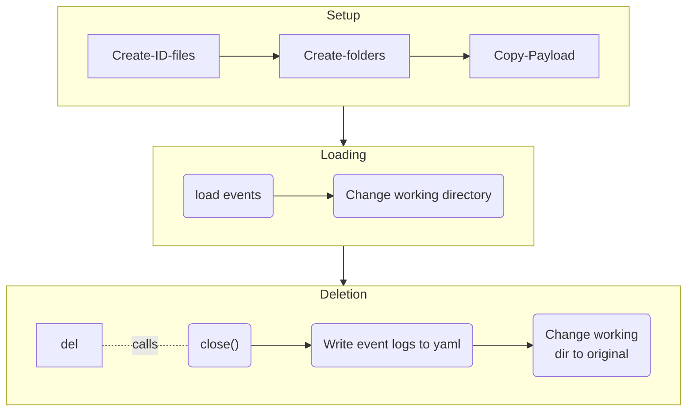
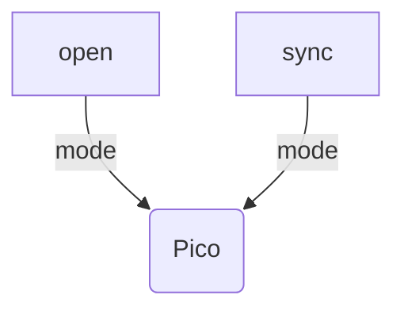
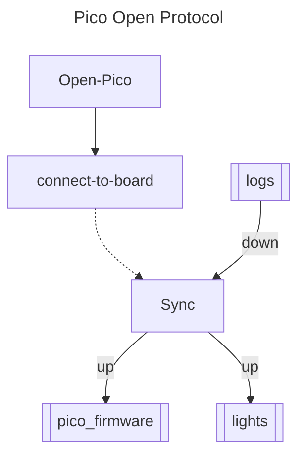
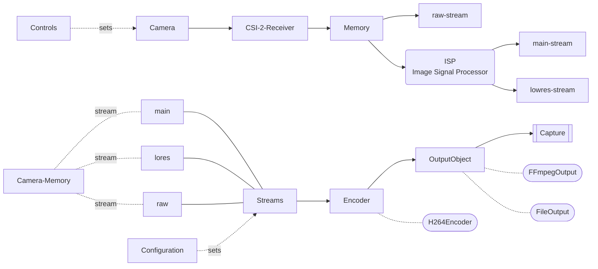

# scope-cli
Control Layer Interface for the Microscopes that sit on the Raspberry Pi.


## Start-up

+ Start control layer utility with `python main.py`.
+ On Raspian (Linux machine), and during experiments, use `trappyscope` utility, that sets real-time priority on the thread. It only works for Linux.
+ Usage:
```bash
python main.py <script1> <script2> <script3>
trappyscope <script1> <script2> <script3>
```
+ The scripts are executed in sequence and can be used to load pre-defined experimental protocols.

+ Alternatively, to load a script/execute a script, use on REPL:

```python
LoadScript("scriptfile.py")
```


## An `Experiment`

### File Structure

```
Experiment_name
		|- .experiment 			        (identifier)
		|- experiment.yaml          (event logs)
		|- data1, data2, data3, ... (data - in the repository)
		|- postprocess              (postprocessed data)
		|- analysis                 (analysis results)
```

### Flow of Control



### LoadScript utility


### Configuration Files

1. `camconfig.yaml` : Contains the camera configuration file for the default mode.
2. `deviceid.yaml` : Contains the  unique identity constants for the device.
3. `common.py`  : Contains common constants for all devices.


###  Current Sequence


### Connected Hardware


## Hardware firmware
The hardware firmware is synched to the pico device in parts. 

**Pico Connection and FS Sync:**






### Device ID

Examplar Device ID file:

```yaml
# Do Not change ----------------
name      : M1
uuid      : "uuid"
type      : microscope
# ------------------------------

hardware:
  pico         : [pico1, "uuid"]
  camera       : [rpi_hq_picam2, "hardware_camera_id"]
  illumination : CA_PWM_RGB_LED_5mm
```

The default mode for parsing a device ID structure is to first cast each field to a container/collection type and enforce the first value as the unique name and the 2nd value, if present, as a **Universal** unique identifier.


### Experiments

1. The `Experiment` class manages the saving of data in  specific folders and logs experiement events.
2. A folder qualifies as an Experiemnt if it contains the `.experiment` file with the UUID of the experiment.
3. The file `<Experiment_name>.yaml` contains the event logs of the experiments.


### PiCamera 2 Library

+ There are `streams`, `outputs`, and `encoders`. All of these need to be created and connected for the camera to work.
+ QT windows are blocking in nature. It is important to understand how to make them async and non-blocking.

#### Stream Configurations

+ default: fps=30, res = 1980X1080
+ default2 : fps=30, res = 2028X1080

+ largeres : fps=10, res=4056X3040
+ largefps : fps=120.03, res=1332X990

**Configuration and Control Structures:**

+ "preview" : used for previews. — no auto adjustments.
+ "still" : used for images. — no auto adjustments.
+ "video" : used for videos — no auto adjustments.
+ "default" : default video configuration — all auto adjustments enabled as in defaults.

**Image Formats:** 

1. For most operations: `XBGR8888` : [R, G, B, 255]. It is the default.
2. For Raw Captures, it must be set to: `BGR888` : [R, G, B]

#### PiCamera 2 Harware-ISP Model



+ The main and lores streams need to have the same `colour_space` whereas, the raw stream has the camera hardware defined color space. **The choise is left to the PiCamera2 autosettings.**
+ 


#### Modes of operation:

0. "preview" : Gray window
1. "image": Working corretly, however the startup overhead is significant.
2. "image_trig" : Gray window and process blocks indefinately after trigger.  
3. "timelapse"	  : Not tested 
4. "video"	      : Ok
5. "videomp4"     : Ok   
6. "video_noprev" : Ok 
7. "video_raw"    : Implemented  
8. "ndarray"		  : Not implemented
9. "stream"		    : Not implemented


### TODO

+ DONE: `pyboard` seems to be corrupt. Replace it. Or check if the error only persists if no device is connected.
+ DONE: Fix Camera selector
2. Clean scope-cli folder.
+ DONE: Fix experiment class
4. Review each function of PiCamera 2 control layer.
+ DONE: Add null pico-device implementation.
+ CANCELLED : Add null-led device option. 
+ CANCELLED: Device declaration before the fluff.header() should dump formatted yaml instead of a python dict.
+ DONE:  Add Living Physics, IGC to the fluff.header().
9. Interpretor ascelation from `python3` to `python`.
+ DONE: Fix abcs import issues.
11. Camera Abstract class add `is_open()` method. `configure()` change of kwargs.
+ DONE: Check if `Experiment` class changes current wd of the python kernal.
12. What is the ideal ExposureTime?
13. Should a monolithic configuration structure be used for all 3 modes in picamera2?
14. Change file_server to sync_server
15. Add `--dry-run`confirmation during file sync operations. Two modes: "off", "on", "ask user".
16. Add flags to the main.py file with option to skip the mandatory exp check.
17. 

