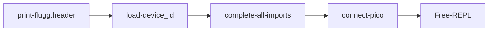
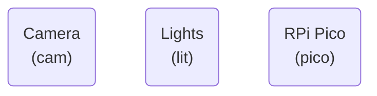

# scope-cli
Control Layer Interface for the Microscopes that sit on the Raspberry Pi.


### Configuration Files

1. `camconfig.yaml` : Contains the camera configuration file for the default mode.
2. `deviceid.yaml` : Contains the  unique identity constants for the device.
3. `common.py`  : Contains common constants for all devices.


###  Current Sequence





### Connecting Hardware




### Device ID

Examplar Device ID file:

```yaml
# Do Not change ----------------
name      : M1
uuid      : "uuid"
type      : microscope
# ------------------------------

hardware:
  pico         : [pico1, "uuid"]
  camera       : [rpi_hq_picam2, "hardware_camera_id"]
  illumination : CA_PWM_RGB_LED_5mm
```

The default mode for parsing a device ID structure is to first cast each field to a container/collection type and enforce the first value as the unique name and the 2nd value, if present, as a **Universal** unique identifier.


### Experiments

1. The `Experiment` class manages the saving of data in  specific folders and logs experiement events.
2. A folder qualifies as an Experiemnt if it contains the `.experiment` file with the UUID of the experiment.
3. The file `<Experiment_name>.yaml` contains the event logs of the experiments.


### TODO

0. `pyboard` seems to be corrupt. Replace it. Or check if the error only persists if no device is connected.
1. Fix Camera selector
2. Clean scope-cli folder.
3. Fix experiment class
4. Review each function of PiCamera 2 control layer.
5. Add null pico-device implementation.
6. Add null-led device option.
7. Device declaration before the fluff.header() should dump formatted yaml instead of a python dict.
8. Add Living Physics, IGC to the fluff.header().
9. Interpretor ascelation from `python3` to `python`.
