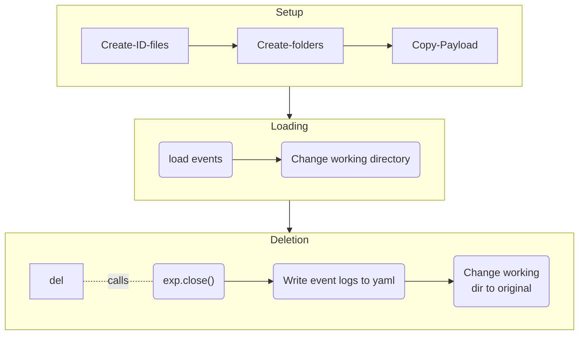
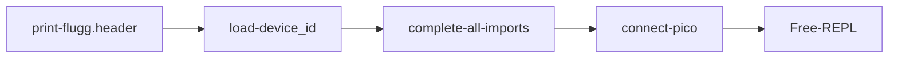
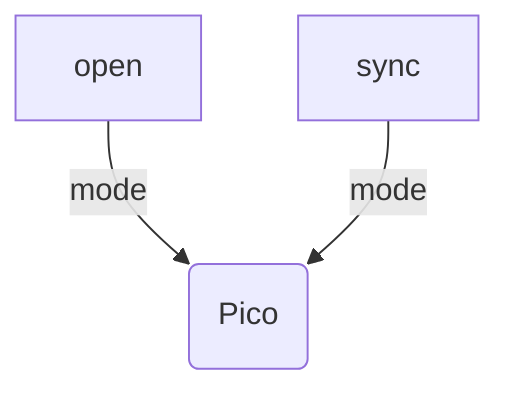
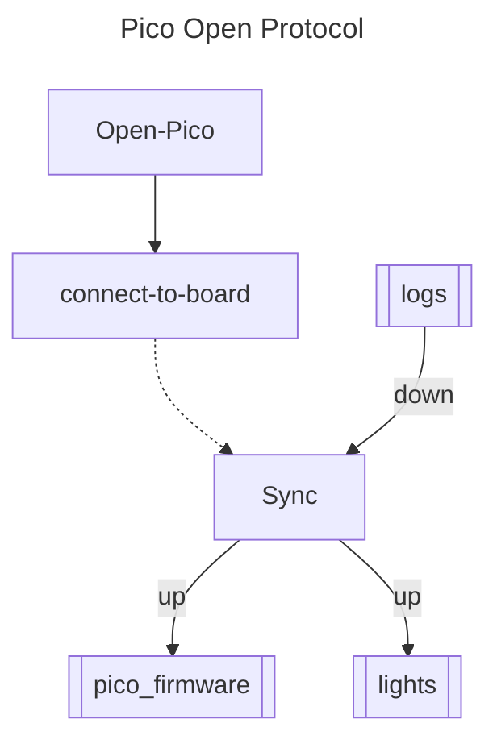

# scope-cli

Control Layer Interface for parallel microscopy system.


## Introduction

TODO


## Installation

```bash
git clone -r <repo_link>
cd <scope-cli>
python main.py --install
```

## Trappy-Scope Tool

```bash
python main.py -h
```

```
usage: Trappy-Scopes scope-cli [-h] [-itr N <script>] [-su <user-initials>] [--login <user-initials>] [-exp <exp-name>] [-noep] [-noff] [--intro]
                               [-mp4 <exp-name>] [-fps <fps>] [-install] [-loc] [-uid]
                               [<script>]

Trappy-Scopes Control Layer

positional arguments:
  <script>              List of scripts to execute in sequence

optional arguments:
  -h, --help            show this help message and exit
  -itr N <script>, --iterate N <script>
                        Specify the number of iterations to perform for a given script.
  -su <user-initials>, --setuser <user-initials>
                        Login/Set user for the microscope.
  --login <user-initials>
                        Login/Set user for the microscope.
  -exp <exp-name>, --experiment <exp-name>
                        Set the experiment.
  -noep, --noep         Skip prompt to select experiment
  -noff, --nofluff      Supress all the fluff during startup.
  --intro               Print the scope CLI introduction document.
  -mp4 <exp-name>, --mp4 <exp-name>
                        Convert all the .h264 videos in the experiment folder to .mp4 videos.
  -fps <fps>, --fps <fps>
                        Specify the fps for conversion to mp4.
  -install, --install   Do installation of all required python and Unix libraries required for trappyscopes.
  -loc, --loc           Count lines of code for this project.
  -uid, --uid           Generate a trappy-scopes (systems) unique identifier.
```

## Start-up and usage

+ Start control layer utility with `python -i main.py` in the interactive mode. 
+ On Raspian (Linux machine), and during experiments, use `trappyscope` utility, that sets real-time priority on the thread. It only works for Linux.
+ When using script files, the `-i` flag, which enables the python interactive mode may be ommited.
+ Usage:
```bash
python main.py <script1> <script2> <script3>
trappyscope <script1> <script2> <script3>
python main.py --iterate 3 <script1> ## Run Script1 three times
```
+ The scripts are executed in sequence and can be used to load pre-defined experimental protocols.

+ Alternatively, to load a script/execute a script, use on REPL:

```python
ScriptEngine.now(globals(), "scriptfile.py")
```

+ All data-collection should be done within the context of an `Experiment`:
	```python
	exp = Experiment("test")
	```

	You should get the following output:

	```bash
	────────────────────────────── Experiment open ─────────────────────────────────────────
	[17:21:08] INFO     Loading Experiment: test                                                                                                experiment.py:267
	Working directory changed to: /Users/byatharth/experiments/test
	.
	├── .experiment
	├── analysis
	├── converted
	├── experiment.yaml
	├── postprocess
	└── sessions.yaml
	
	3 directories, 3 files
	
	user:ghost || ‹‹M1›› Experiment: test 
	>>> 
	```
	
+ You should also login as a user:

	```python
	User.login("YB")
	```

	The python terminal prompt should change to:

	```bash
	user:YB || ‹‹MDev›› Experiment: test >>> 
	```


## Describing one scope

A `scope` is described as a tree of devices. It is a combination of Processors (`ProcessorGroup`), `Sensors` , and `Actuators`. A scope configuration is defined in the `deviceid.yaml` configuration file. An example is given below:

```yaml
name: MDev
uuid: null
type: microscope
frame:
- pico
- topplate
- lit
- diffuser
- lenses.asphere
- sample
- samplestage
- midplate
- zoomlens
- zoomlensholdplate
- camera
- baseplate
optics:
  lenses:
  - 120deg plastic asphere
  - ACL2520U
  - zoomlens
hardware:
  pico:
  - nullpico
  - pico1
  - nullpico
  camera: nullcamera
  illumination: CA_PWM_RGB_LED_5mm
git_sync: false
write_server: ssd1
file_server: smb://files1.igc.gulbenkian.pt/igc/folders/LP/yatharth
auto_fsync: false
auto_pico_fsync: true
```

## Describing N-scopes

Multiple scopes are defined by defining each of the configuration files on each of the scopes. After this is done, the network layer allows the scopes to be connected to the laboratory hive, where all scopes can be accessed on the fly.


## How to do Science on the scopes?

## An `Experiment`

The data and metadata collection for any experiment is handled through the `Experiment` class. It's primary role is to manage storage for every different experiments. Creation of the class, immediately changes the working directory to the experiment one. 

### Unique ID

Each experiment is also assigned a 10-digit hex unique id. Example: `e8423b83d2`. 

### File Structure

Each experiment has the following directory structure:

```
Experiment_name
		|- .experiment 			        (identifier)
		|- experiment.yaml          (event logs)
		|- data1, data2, data3, ... (data - in the repository)
		|- postprocess              (postprocessed data)
		|- converted                (online conversion - eg. between video formats)
		|- analysis                 (analysis results)
```

### Flow of Control - TODO check with the current version



### LoadScript utility TODO


### Configuration Files

1. `camconfig.yaml` : Contains the camera configuration file for the default mode.
2. `deviceid.yaml` : Contains the  unique identity constants for the device.
3. `common.py`  : Contains common constants for all devices.


###  TODO: Obsolete Current Sequence





### Hardware

The hardware is modelled as a device-tree or a hierarchical collection of devices. All nodes that are not end-nodes are turing complete computational devices.

```python
assembly: 
 | rpi: null
 | cam: camera
 | pico: 
 | | lit: light
 | | beacon: beacon
 | | tandh: t&h sensor
 | 
 *
```

## Hardware firmware

The hardware firmware is synched to the pico device in parts. 

**Pico Connection and FS Sync:**






### Device ID

Examplar Device ID file:

```yaml

```


The default mode for parsing a device ID structure is to first cast each field to a container/collection type and enforce the first value as the unique name and the 2nd value, if present, as a **Universal** unique identifier.


### Experiments

1. The `Experiment` class manages the saving of data in  specific folders and logs experiement events.
2. A folder qualifies as an Experiemnt if it contains the `.experiment` file with the UUID of the experiment.
3. The file `<Experiment_name>.yaml` contains the event logs of the experiments.


