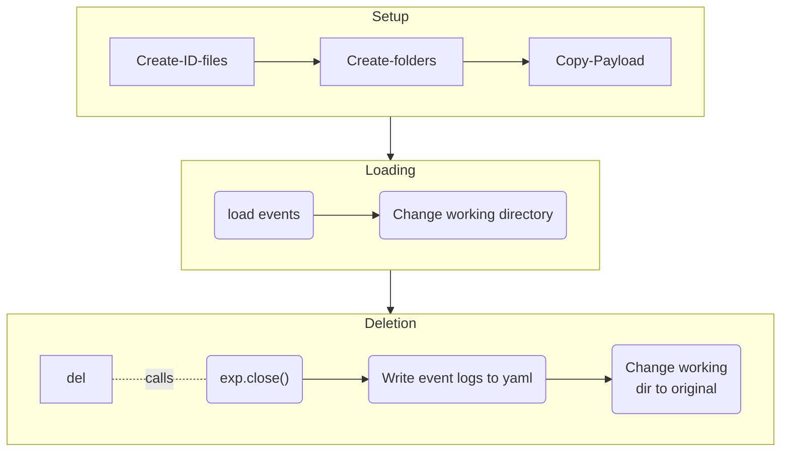
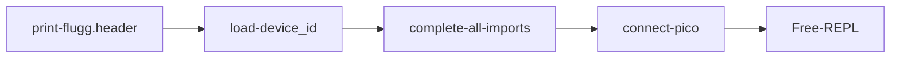
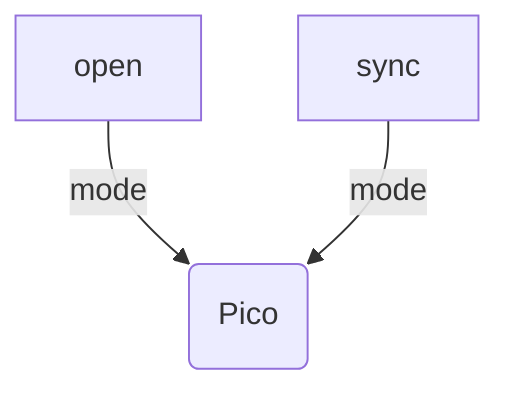
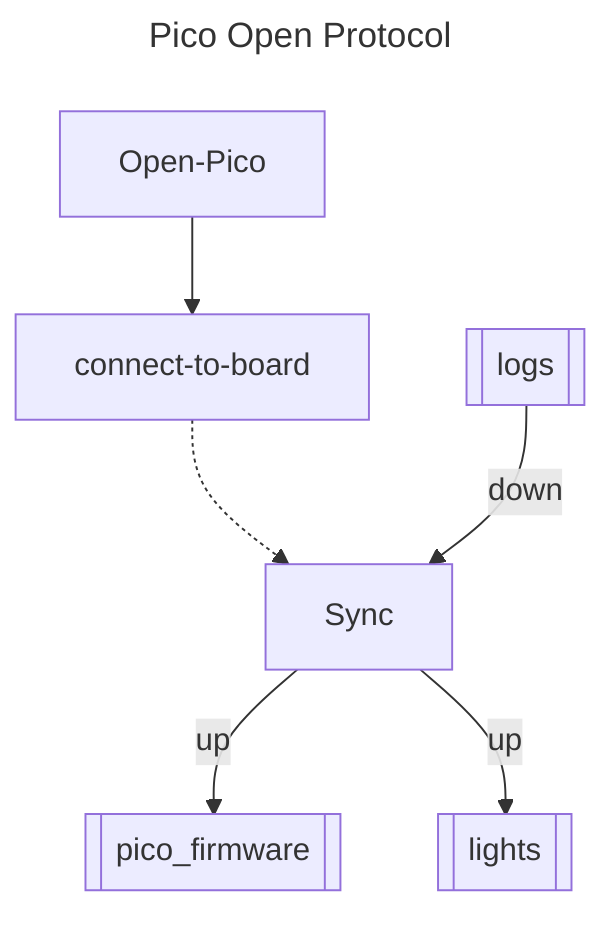

# scope-cli
Control Layer Interface for the Microscopes that sit on the Raspberry Pi.


### TODO

14. Change file_server to sync_server
15. Add `--dry-run`confirmation during file sync operations. Two modes: "off", "on", "ask user".
16. Add flags to the main.py file with option to skip the mandatory exp check.
TODO:
1. Setup the LifetimeMachine configuration:
	a. Camera-configuration, Chunk-size, duration.
	b. 


## Installation

```bash
git clone -r <repo_link>
cd <scope-cli>
python install_py_libs.py
```


## Start-up and usage

+ Start control layer utility with `python -i main.py`. 
+ On Raspian (Linux machine), and during experiments, use `trappyscope` utility, that sets real-time priority on the thread. It only works for Linux.
+ When using script files, the `-i` flag, which enables the python interactive mode may be ommited.
+ Usage:
```bash
python main.py <script1> <script2> <script3>
trappyscope <script1> <script2> <script3>
```
+ The scripts are executed in sequence and can be used to load pre-defined experimental protocols.

+ Alternatively, to load a script/execute a script, use on REPL:

```python
LoadScript("scriptfile.py")
```

+ All data-collection should be done within the context of an `Experiment`:
	```python
	exp = Experiment("test")
	```

	You should get the following output:

	```bash
	Experiment so far: 
	['.experiment', 'experiment.yaml']
	Working directory changed to: /Users/byatharth/experiments/test
	|| ‹‹MDev›› Experiment: test >>> 
	```

+ You should also login as a user:

	```python
	set_user("YB")
	```

	The python terminal prompt should change to:

	```bash
	user:YB || ‹‹MDev›› Experiment: test >>> 
	```

## An `Experiment`

The data and metadata collection for any experiment is handled through the `Experiment` class. It's primary role is to manage storage for every different experiments. Creation of the class, immediately changes the working directory to the experiment one. 

### Unique ID

Each experiment is also assigned a 10-digit hex unique id. Example: `e8423b83d2`. 

### File Structure

Each experiment has the following directory structure:

```
Experiment_name
		|- .experiment 			        (identifier)
		|- experiment.yaml          (event logs)
		|- data1, data2, data3, ... (data - in the repository)
		|- postprocess              (postprocessed data)
		|- converted                (online conversion - eg. between video formats)
		|- analysis                 (analysis results)
```

### Flow of Control - TODO check with the current version



### LoadScript utility TODO


### Configuration Files

1. `camconfig.yaml` : Contains the camera configuration file for the default mode.
2. `deviceid.yaml` : Contains the  unique identity constants for the device.
3. `common.py`  : Contains common constants for all devices.


###  TODO: Obsolete Current Sequence





### Hardware

The hardware is modelled as a device-tree or a hierarchical collection of devices. All nodes that are not end-nodes are turing complete computational devices.

```python
assembly: 
 | rpi: null
 | cam: camera
 | pico: 
 | | lit: light
 | | beacon: beacon
 | | tandh: t&h sensor
 | 
 *
```

## Hardware firmware

The hardware firmware is synched to the pico device in parts. 

**Pico Connection and FS Sync:**






### Device ID

Examplar Device ID file:

```yaml
# Do Not change ----------------
name      : M1
uuid      : "uuid"
type      : microscope
# ------------------------------

hardware:
  pico         : [pico1, "uuid"]
  camera       : [rpi_hq_picam2, "hardware_camera_id"]
  illumination : CA_PWM_RGB_LED_5mm
```

The default mode for parsing a device ID structure is to first cast each field to a container/collection type and enforce the first value as the unique name and the 2nd value, if present, as a **Universal** unique identifier.


### Experiments

1. The `Experiment` class manages the saving of data in  specific folders and logs experiement events.
2. A folder qualifies as an Experiemnt if it contains the `.experiment` file with the UUID of the experiment.
3. The file `<Experiment_name>.yaml` contains the event logs of the experiments.


