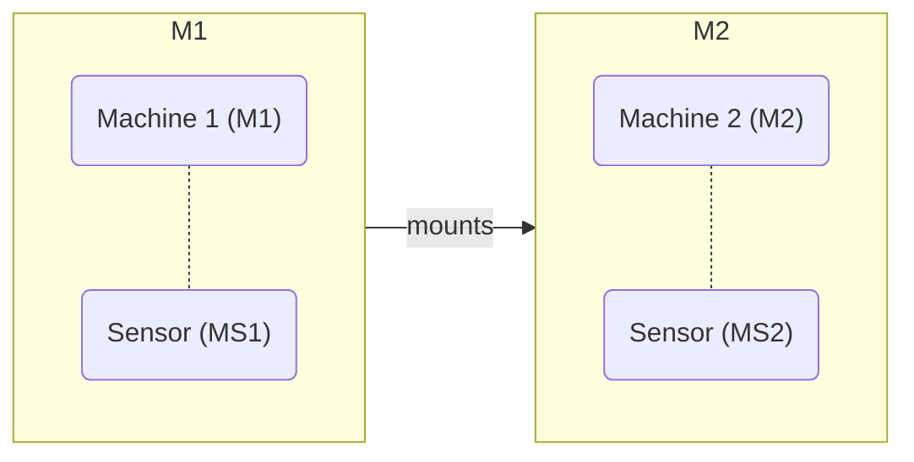

# trappyscopes-cli


## (Trappy-Scopes command line interface)

trappyscopes is a python framework for building and controlling laboratory instruments. It facillitates the creation of highly heterogenous instrument assemblies by integration any existing python package. The aim of  `trappyscopes` is to enable fast deployment of paralel measurement systems that are software defined.

The base model of this library imagines instruments as an arbitrary tree of python enabled computers and "pythonic" microcontrollers (micropython or circuitpython). With this base model, the control layer enables plug and play interfacing with minimal configuration. The key idea is to have the following workflow while building instruments.

1. Connect all components with their respective interfaces (serial, ethernet, over wifi etc)
2. Install this library and all required 3rd party packages for the components.
3. Define the structure of the instrument in a configuraion file.
4. You are done! Launch the cli to acquire data.


### Some other salient features of the framework

1. Pythonic interfacing
2. Software defined infrastructure is at the core of lab management.
3. Made to support parallelization and open-source instrumentation.
4. Seemlessly interfaces with any existing python pacakge.


### A quick example

Given the following configuration of instruments, where M1 and M2 are separate machines connected by a network:




```python
# These commands work on M1
scope.MS1.read()
scope.M2.MS2.read()
```

Given the configuration:

```yaml
ScopeAssembly:
  ...
  MS1:
    description: Sensor on Machine 1.
    kind: sensor1.library.Sensor1Constructor
    args: []
    kwargs: {}
  M2:
    description: Machine 2 over netwwork.
    kind: hive.processorgroups.remote.RemoteGroup
    args: []
    kwargs:
      - automount: True
```


## Installation

1. Install through `pip`

  ```bash
  pip install trappyscopes
  ```

2. You can install directly from the source and install the environment using the inbuilt command to build the environment.

  ```bash
  git clone -r <repo_link>
  cd <trappyscopes>
  python main.py --install
  ```

3. Basic information about application startup
  ```bash
  python main.py -h
  ```

4. `python main.py` can be replaced by `./ts`, which is a bash script that does the same (plus some extra things). You might have to run `chmod +x ts` or `sudo +x ts` to provide executable priviledges to the script.


## Configuring a scope

1. `trappyscopes` cli is configured through a `YAML` configuration file. Let´s start by generating a configurartion file.

  ```bash
  python main.py --new_config
  ```

  This generate the following files in the home directory:
  ```
   (~)
    |-trappyverse
    . |- trappyconfig.yaml
      .
  ```
2. `trappyverse/trappyconfig.yaml` is the default configuration file name and should be unchanged. We can have more than one configuration file on a system. To start the software with a custom configuration file:

  ```bash
  python main.py --config ~/parallelverse/customconfig.yaml
  
  ## Override default configuration options with this file (useful when more than one scope 
  ## configurations need to be defined)
  python main.py --add_config ~/parallelverse/customconfig.yaml
  ```
3. Now let's look at the configuration file!
  1. The first two lines are these:

    ```yaml
    name: <hostname>          # Name of the scope, which defaults to hostname. The is defined as the global variable `scopeid` with the defaul startup recipie. 
    kind: mystery-device      # A signle word descriptor for the device.
    description: The functionally has not been described yet # A short description of the functionality of the device.
    ```
    
    These fields can be edited as such and are of little consequence in terms of programming. The `name` must be chosen with care, and it's recommened that it is also the hostname of the machine. This makes remote access easy and preventss conflicts. 
    
    `name: MDev` is a special name, which defines any device as a "Development Scope" and has some special priveledges. For more information, check the [`MDev`](notes/mdev.md) entry in the notes.

  2. Now let's set check some configuration options and learn what they do:

    ```yaml
    config:
      trappydir: ~/trappyverse   # Directory where the configuration of the scope is stored.
      ui_mode: interactive       # User interaction mode
      venv:                      # Whether to use a virtual environment for 
          active: true                # Config block is active. The function is turned on.
          command: source ~/opt/miniconda3/bin/activate 
          name: trappy                # Name of the virtual environment that will be called after the command
        git_sync:                  # Automatically git-sync certain repositories
          active: true                # Config block is active. The function is turned on.
          command: git pull           # Exact command to use for git syncronisation
          repos:                      # List of local repositories, where the command will be called
            - ~/lab_protocols/
            - ~/lab_scripts/                     
        set_wallpaper: false       # This option will set a "information" panel as the wallpaper. This helps to id the device, incase of multiplexing.
        log_level: 20              # Log level of the root logger. Use 10 for debug. 20 is info and higher.
        config_server:             # Configuration files are synchronised with this server, when changed.         
          active: true
          server: <ip>/<address>
          share: <name-of-server-share>
          destination: "{date}"   # Sub folder inside the share. This will create a folder with the "current date" opon operation.
          username: <username>
          password: <password>
        config_redact_fields:     # Fields that will be redacted, if the config file is copied
          - username
          - password
        startup_recipie: core.startup  # Startup procedure that defines how the CLI environment is created. `core.startup.__init__.py` defines the default one.
        startup_scripts:          # Scripts to run by default when the CLI is started.   
        - ./scripts/script1.py
        - ./scripts/script2.py
      
    ```
    
    Note some key features here: 
      1. Any mapping can be turned off by defining a field `active: false` inside it. If this argument is skipped, then it's assumed to be `true`.
      2. Custom addresses (like the `destination` in `config_server`) can be defined with an "effifible" string (inspired by the f-strings in python):


  ```yaml
  config_server:
  destination: "{date}_{scopeid}_{user}" # -> 2025_05_01_microscope1_User1
  ```


    The following terms can be used: `scopeid`, `user`, `date`, and `time`.
    
    3. Now let's look at the default `ScopeAssembly` block below:
    
    ```yaml
    ScopeAssembly:
      <hostname>: 
        description: "Host processorgroup."
        kind: hive.processorgroups.linux.LinuxMachine
        args: []
        kwargs: {}
    ```
    
    The device that we see here is the host computing machine that is detected and mounted. It is one of the devices under the `ScopeAssembly`, which is identified as the global variable `scope`. Within the scope assembly, we can define an arbitrary number of devices with the follwing schema:
    
    ```yaml
    ScopeAssembly:
      device_name:
        active: true
        description: Provide a meaningful description of the device.
        kind: <path.to.object.Constructor>
        args: []   # Arguments that are passed to the object constructor.
        kwargs: {} # Keyword arguments passed to the object constructor.
        # Optional configuration
        metaclass: hive.detector.Detector  # Define the object as a detector and extend its functionality
        read_method: capture  # Method of the origianl object that is interpreted as the "read" method.
          args: []            # These will be wrapped in a `functools.partial` instance.
          kwargs: {}          # These will also be wrapped in a `functools.partial` instance.
        write_method: set # Similar to the "read_method" option.
          args: []            # These will be wrapped in a `functools.partial` instance.
          kwargs: {}          # These will also be wrapped in a `functools.partial` instance.
    ```
    
    For more information regarding the optional configuration options, refer to: [notes/devices.md](notes/devices.md).

  4. For now, we can leave the previous block as it was and quickly gloss over the `Experiment` configuration block:

    TODO: Git auth for protocols.
      
    ```yaml
    Experiment:
      exp_dir: ~/experiments              # Default directory where experiments are stored
      protocols_dir: ~/lab_protocols      # Directory where protocols are stored, This can also be a git-address.
      calibration_dir: ~/calibration_dir  # Directory where calibrations are stored.
      exp_dir_structure:                  # This is the directory structure, that will be created within every experiment.
        - scripts
        - postprocess
        - converted
        - analysis
      exp_report: false                   # Whether the pdf report functionality is turned on or not.
      eid_generator: core.uid.uid         # This is the funtion that will be called to generate experiment IDs. By default is calls `nanoid.generate('1234567890abcdef', 10)`
      file_server:                        # File server for synchronisation of experiments
        active: true
        server: <ip>/<address>
        share: <name-of-server-share>
        destination: "{date}"
        username: <username>
        password: <password>
    ```

  5. The configuration is defined in `core.permaconfig.config.py` as `TrappyConfig`. It uses the [Confuse](https://confuse.readthedocs.io/en/latest/usage.html#confuse-painless-configuration) library as a base.

 


##  Basic Usage


1. Start-up and usage

+ Open an interactive session:
  ```bash
  ./ts -su UserName
  ```

2. Scripts are an important part of running experimental procedures:

+ The scripts are executed in sequence and can be used to load pre-defined experimental protocols:
  ```bash
  ts <script1> <script2> <script3>
  ts <script1> <script2> <script3>
  ts --iterate 3 <script1> ## Run Script1 three times
  ```

+ Alternatively, to load a script/execute a script from the interactive session:
  ```bash
  ScriptEngine.run(globals(), scripts=["scriptfile.py"])
  ```

3. Start an experiment

+ All data-collection should be done within the context of an `Experiment`. It manages the data and metadata collection for an experiment: 

  ```python
  exp = Experiment("test")

  # OR
  # Constructs a better defnined name: 'MDev__YB__2025_08_23__5hh_55mm__test_experiment__6a092b60dc'
  exp = Experiment.Construct(["test", "experiment"])
  ```

+ Creation of an instance immediately changes the working directory to the experiment one. You should get the following output:

  ```bash
  >>> exp = Experiment.Construct(["test", "experiment"])
  {
      'name': 'MDev__YB__2025_08_23__5hh_55mm__test_experiment__6a092b60dc',
      'eid': '6a092b60dc',
      'created': datetime.datetime(2025, 8, 23, 5, 55, 12, 771720),
      'syspermastate': {
          'mac_address': <MAC:ADDRESS>,
          'ip_address': <IP:ADDRESS>,
          'hostname': <HOSTNAME>,
          'os': ['Darwin', '21.6.0']
      }
  }
  ──────────────────────────────────── <Session: 6a092b60dc> ────────────────────────────────────
  [05:55:13] INFO     Creating new experiment:                                  experiment.py:296
                      MDev__YB__2025_08_23__5hh_55mm__test_experiment__6a092b60dc
  ─────────────────────────────────────── Experiment open ───────────────────────────────────────
             INFO     Loading Experiment:                                        experiment.py:305
                      MDev__YB__2025_08_23__5hh_55mm__test_experiment__6a092b60dc
             WARNING  Experiment state not found. Not a problem if this is a new experiment.      experiment.py:338
  Working directory changed to:
  /Users/byatharth/experiments/MDev__YB__2025_08_23__5hh_55mm__test_experiment__6a092b60dc
  .
  ├── .experiment
  ├── analysis
  ├── converted
  ├── experiment.yaml
  ├── postprocess
  ├── scripts
  └── sessions.yaml

  4 directories, 3 files

  user:YB || ‹‹MDev›› Experiment: MDev__YB__2025_08_23__5hh_55mm__test_experiment__6a092b60dc
  ```

+  The `Experiment` class manages the saving of data in  specific folders and logs experiement events. 
+ A folder qualifies as an Experiemnt if it contains the `.experiment` file with the unique identifier of the experiment.  The file `experiment.yaml` contains the event logs of the experiments, 
+ Each time an experiment is open, a new session is created. An `Experiment` is a composed of an arbitrary number of sessions. The `sessions.yaml` contains the environment information (list of packages, version control number, etc) for each session.

+ Additionally, you can use the following utility functions:
  ```python
  ## Find and open an existing experiment
  exp = findexp() ## Press enter to open a prompt with available experiments
  
  ## Find an delete an existing experiment
  ## Warning: this is an irreversible deletion
  delexp()
  ```

+ The `Experiment` philosophy is defined in the [expframework](expframework/README.md) submodule.


## Let's do a simple experiment

