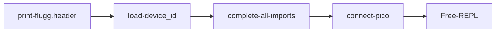
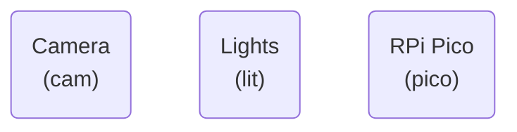

# scope-cli
Control Layer Interface for the Microscopes that sit on the Raspberry Pi.

### Configuration Files

1. `camconfig.yaml` : Contains the camera configuration file for the default mode.
2. `deviceid.yaml` : Contains the  unique identity constants for the device.
3. `common.py`  : Contains common constants for all devices.

###  Current Sequence

### Connecting Hardware

### Experiments

1. The `Experiment` class manages the saving of data in  specific folders and logs experiement events.
2. A folder qualifies as an Experiemnt if it contains the `.experiment` file with the UUID of the experiment.
3. The file `<Experiment_name>.yaml` contains the event logs of the experiments.

### TODO

1. Fix Camera selector
2. Clean scope-cli folder.
3. Fix experiment class
4. Review each function of PiCamera 2 control layer.
