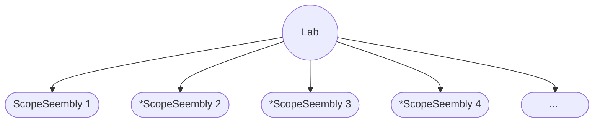
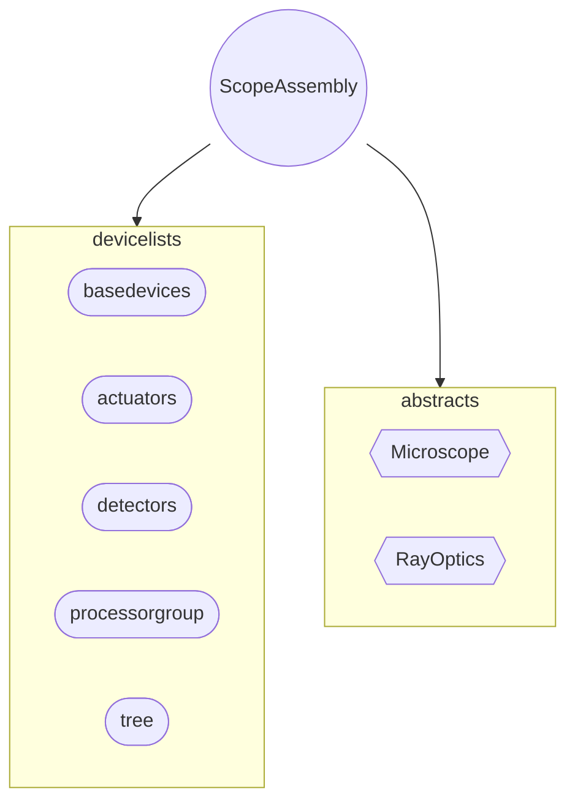

# `hive` module


## Laboratory level structure



$*$ : It's a remote SSH/Rpyc connection layer that mimics the actual scope assembly.

## Scope level structure





## ScopeAssmebly

The scope assembly is composed of two paradigms:

1. `devicelists`: collection of available peripheral devices which are non-unique and can be shared across groups.

	1. `basedevices`: collection of all devices, as everything derives from the `BaseDevice` object.
	2. `actuators` : collection of all objects that inherit the `Actuator` interface.
	3. `detectors` : collection of objects that inherit the `Detector`interface.
	4. `processgroups`: collection of objects that represent processors and can be used to launch processes.
	5. `tree`: a tree data structure that sequentially mounts all peripherals into a tree datastructure.

2. `abstracts` : collection of modules that create virtual abstractions to a collection of devices. A few examples are below:

	```python
	## A Simple Microscope Abstraction
	class Microscope:
	  def __init__(self, scopeassembly):
	    self.lights = scopeassembly.lights
	    self.cam = scopeassembly.cam
	    self.x_motor = scopeassembly.motorset[0]
	    self.y_motor = scopeassembly.motorset[1]
	    self.z_motor = scopeassembly.motorset[2]
	```

	```python
	## A simple lux estimator using a CMOS camera (which implements the __lux__ function)
	from hive.detector import Detector
	class CamLux(Detector):
	  def __init__(self):
	    from functools import partial
	    
	    ##	Average the lux for 30 seconds at the default fps of the camera
	    read = partial(scopeassembly.camera.read, "__lux__", tsec=30)
	    self.read = read
	    
	
	class LuxEstimator:
	  def __init__(self, scopeassembly):
	    self.sensor = CamLux()
	    self.led = scscopeassembly.led ## Single channel
	    
	  def V_lux_curve(self):
	    results = {}
	    for v in np.arange(0, 3, 0.1):
	      self.led.setV(v)
	      results[v] = self.sensor.read()
	    return results
	```

	

	