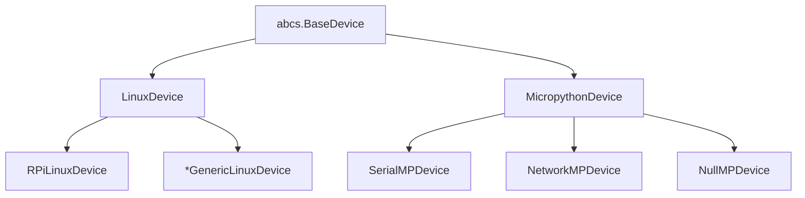
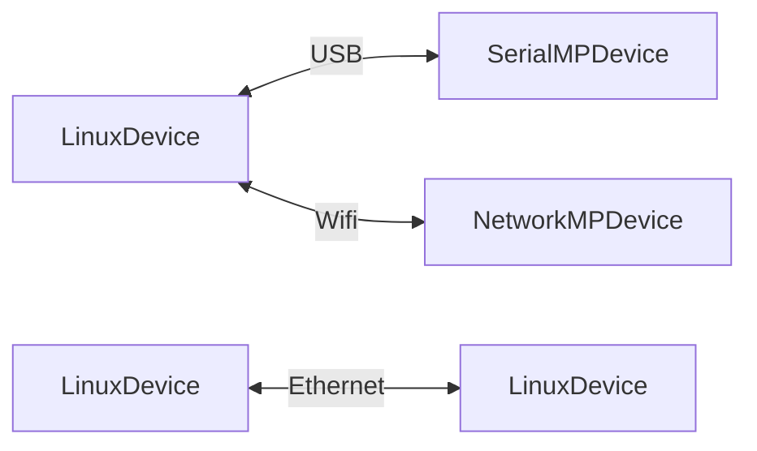
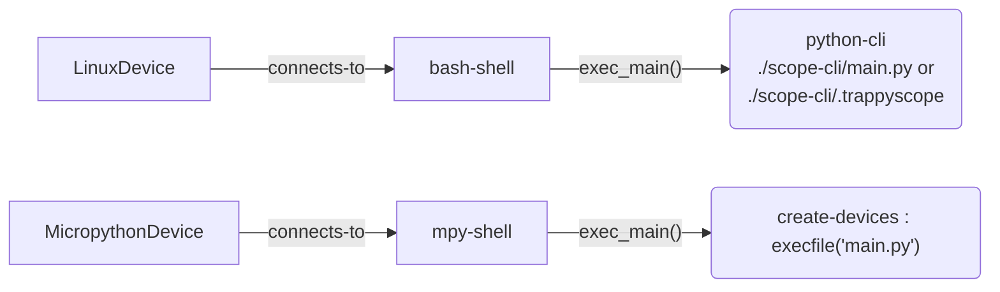

# All the Devices in the Trap-Scopes System (Trappy-System)

Design and implementation document.

---

A `BaseDevice` is a group of processors which can be accessed by a single  `shell` (`device.exec()` method) instance and have their own independent operating system/firmware. 

## Hierarchy and connections





### Common Connection Idioms




## `BaseDevice` specifics

### Shell and "main"



### Processor Group

The `BaseDevice`handles the processor group and keep tracks of processor consumption and load. A `LinuxDevice` can make the decision to disconnect power on itself under zero prospective load.

### `BaseDevice.Proxy`

All `BaseDevice` instances can  emit proxy devices that are either actual or virtual peripherals that are connected downstream to them. This allows the upstream BaseDevice to directly access them.

```python
```

