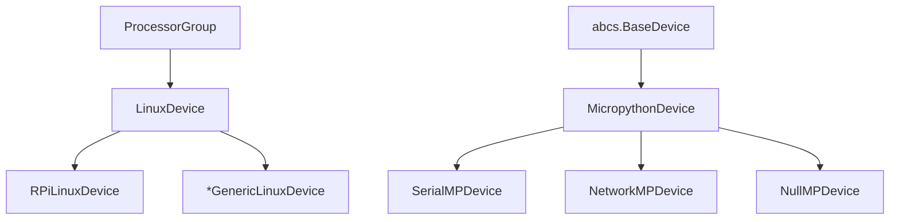
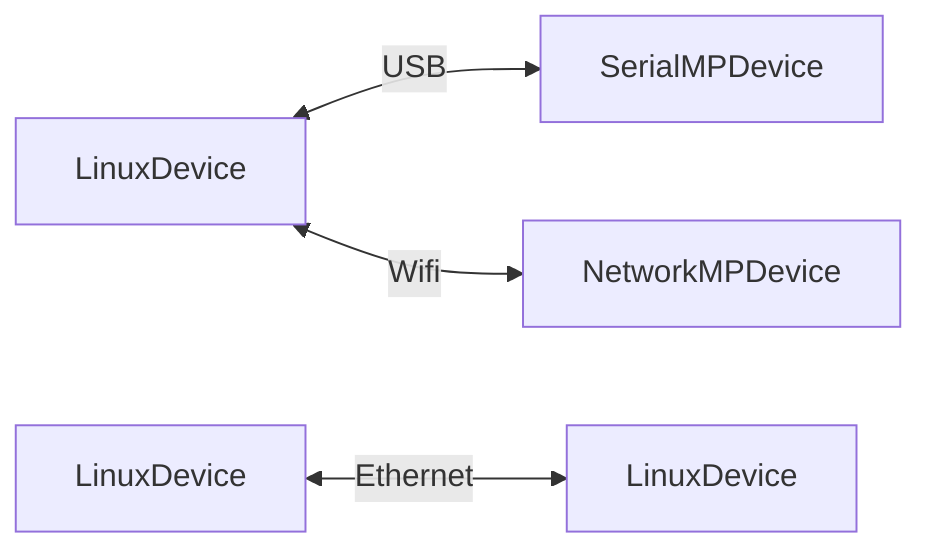
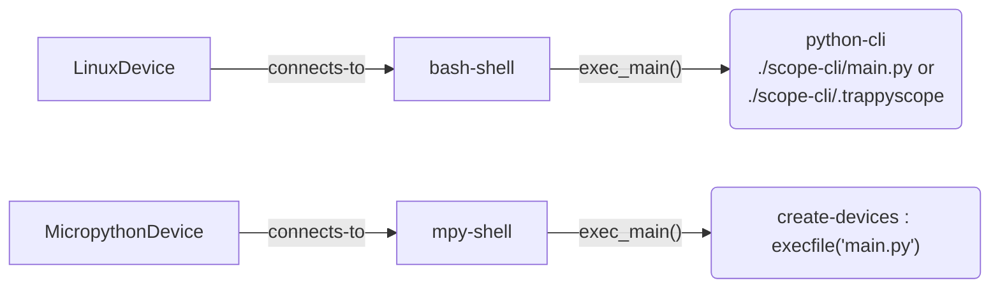

# All the Devices in the Trap-Scopes System (Trappy-System)


Design and implementation document. This document outlines the vision of the `hive` module.

---

A `SimpleDevice` is a device that is atomic and does not have any other devices/abstractions attached to it. A `ComplexDevice` is a multi-layered device, whcih can functionally emit/resolve proxies to the sub-devices that are attached to it.

Types:

1. `SimpleDevice` : stores basic attributes and has no functional significance.
2. `ComplexDevice`: Can emit proxies.

A `BaseDevice` is a group of processors which can be accessed by a single  `shell` (`device.exec()` method) instance and have their own independent operating system/firmware.


## Hierarchy and connections





### Common Connection Idioms




## `BaseDevice` specifics

### Shell and "main"



### Processor Group

The `BaseDevice`handles the processor group and keep tracks of processor consumption and load. A `LinuxDevice` can make the decision to disconnect power on itself under zero prospective load.

### `BaseDevice.Proxy`

All `BaseDevice` instances can  emit proxy devices that are either actual or virtual peripherals that are connected downstream to them. This allows the upstream BaseDevice to directly access them.

```python
```

## MicroPython tooling: `core/external/pyboard.py`

`core/external/pyboard.py` is a vendored copy of MicroPython's own `tools/pyboard.py`
(the raw-REPL connection library `hive/processorgroups/micropython.py` and the device
tree's MicroPython probing are both built on). It is not published on PyPI as its own
package -- it only ships as a file inside the `micropython/micropython` monorepo, meant
to be copied by whoever needs it, which is what going on here.

Considered and dropped: `mpremote` (the official MicroPython CLI, on PyPI) bundles this
exact module internally, importable as `from mpremote.pyboard import Pyboard` -- a real
dependency instead of a hand-vendored file, with `pip`/`uv` handling updates. Not adopted
because the MicroPython project has stated the *next* `mpremote` release drops this
internal module in favor of a different, more comprehensive device-control API still in
development. Depending on `mpremote.pyboard.Pyboard` today would mean depending on an
implementation detail already slated for removal, not a stable contract.

So for now: keep vendoring, and re-sync `core/external/pyboard.py` from
`https://raw.githubusercontent.com/micropython/micropython/master/tools/pyboard.py`
manually every so often (the 2026-09 refresh fixed a real RP2040-specific bug --
`get_time()` called `pyb.RTC()`, which only exists on STM32 Pyboard-branded boards, not
RP2040 -- along with replacing the deprecated `uos`/`uio` module names with `os`/`io`,
and adding real timeout handling to `enter_raw_repl()`/`read_until()`, which had none
before). Worth revisiting once `mpremote`'s new API actually ships.

