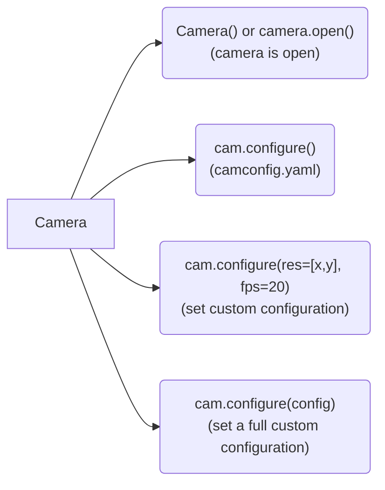
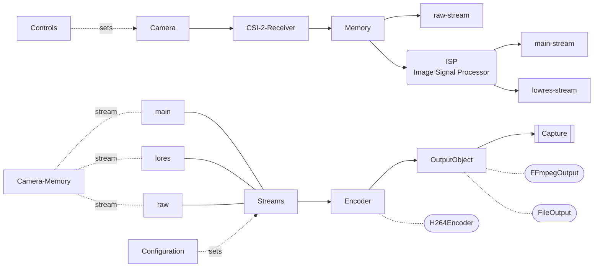

# PiCamera 2 Library


## Camera Construction and Configuration

1. The `camera.open() ` function creates a new `PiCamera2` object and assigns it to the `cam` attribute.
2. The camera object then needs to be configured: `camera.configure()` to the correct settings. There are several ways. More short-hand functions are described in the constructor.



3. 

+ There are `streams`, `outputs`, and `encoders`. All of these need to be created and connected for the camera to work.
+ QT windows are blocking in nature. It is important to understand how to make them async and non-blocking.

#### Stream Configurations

+ default: fps=30, res = 1980X1080
+ default2 : fps=30, res = 2028X1080

+ largeres : fps=10, res=4056X3040
+ largefps : fps=120.03, res=1332X990

**Configuration and Control Structures:**

+ "preview" : used for previews. — no auto adjustments.
+ "still" : used for images. — no auto adjustments.
+ "video" : used for videos — no auto adjustments.
+ "default" : default video configuration — all auto adjustments enabled as in defaults.

**Image Formats:** 

1. For most operations: `XBGR8888` : [R, G, B, 255]. It is the default.
2. For Raw Captures, it must be set to: `BGR888` : [R, G, B]

#### PiCamera 2 Harware-ISP Model



+ The main and lores streams need to have the same `colour_space` whereas, the raw stream has the camera hardware defined color space. **The choise is left to the PiCamera2 autosettings.**
+ 


#### Modes of operation:

0. "preview" : Gray window
1. "image": Working corretly, however the startup overhead is significant.
2. "image_trig" : Gray window and process blocks indefinately after trigger.  
3. "timelapse"	  : Not tested 
4. "video"	      : Ok
5. "videomp4"     : Ok   
6. "video_noprev" : Ok 
7. "video_raw"    : Implemented  
8. "ndarray"		  : Not implemented
9. "stream"		    : Not implemented


---

# RESTRUCTURE: camera system

**Status: planned, not started.** Recorded here on `main` (2026-10-01) because
the restructure plan documents live on `restructure-20260905` and
`docs/notes/projectman.md` is empty. Move this section into the plan docs when
the branches converge.

Everything below was found during the October 2026 single-channel encoder work
and left in place deliberately — none of it is in the seven fixes that shipped.
Items are ordered by how much damage they can do, not by effort.

## R1 — Log sanitisation belongs in `Experiment.log()`, not in the camera

**Problem.** `Camera.read()` writes every kwarg it was handed into the
experiment event log:

```python
Experiment.current.log(f"cam_acq_{action}", attribs={**kwargs, ...})
```

`exp.logs` is dumped to YAML on every `__save__()`, so a kwarg holding a live
object poisons the experiment permanently — PyYAML falls through to
`__reduce_ex__` and raises `TypeError: cannot pickle '_thread.lock' object` on
that save **and every save afterwards**. Any picamera2 encoder carries locks, so
making `encoder` an injectable kwarg was enough to kill two runs
(`camtests_encoders_channels` and `light_perturb_dark`, 2026-10-01). Neither
could be saved or closed afterwards.

Three separable defects, only one of which is "logs each kwarg":

1. **No boundary between the log and live objects.** `**kwargs` carries both
   parameters (data describing the acquisition) and collaborators (objects
   performing it). `read()` cannot tell them apart, so the contract it imposes
   on callers — *everything you pass must be YAML-representable forever* — is
   implicit and unstated.
2. **Unbounded failure domain.** One bad value breaks every future save of the
   experiment, not just the one event. A log entry must never be able to do that.
3. **Caught where it cannot be diagnosed, raised where it cannot be explained.**
   `read()` swallows the `TypeError` in its own `except` — the one place that
   knows an encoder was passed — and it resurfaces at an unrelated `__save__()`
   with a traceback full of PyYAML and no mention of the camera.

**Current stopgap.** `NOLOG_KWARGS = ("encoder",)` in `abstractcamera.py`,
excluding that key from the logged attribs only. Narrow and deliberate; it does
not address any of the three defects above.

**Fix.** Reduce non-primitives to `str()` inside `Experiment.log()`. The
invariant *everything in `exp.logs` is representable* belongs to `Experiment`,
not to each caller — any other route into `exp.logs` can still poison a run.
Then add a fallback in `Experiment.__save__()`: if `yaml.dump` raises, dump a
repr-ified copy rather than losing the experiment. A bad value should cost one
ugly log entry, not the whole run. Once that lands, delete `NOLOG_KWARGS`.

**Scope checked.** Across every `cam.read()` call site in the repo, `encoder` is
the only object-valued kwarg. Functions, lambdas and `functools.partial` all
dump fine (PyYAML tags them), so `filename_fn` passed positionally in
`mjpeg_continuous_autosplit.py:122` — which reaches the log as `filename` — is
not a risk.

## R2 — The reduce-to-YAML-safe helper wants to live in `core/`

It exists in two copies already (`Camera.__getstate__`, and conceptually inside
`Experiment.__save__`), and R1 would add a third. It is a core utility wearing a
disguise. One implementation in `core/`, used by `Experiment.log`,
`Experiment.__save__` and `Camera.__getstate__`. Do this as part of R1.

## R3 — `open()` never applies `self.config`

`Camera.open()` calls `self.cam.configure()` with no argument, so the configured
video mode is not applied. Every acquisition script works around it by calling
`scope.cam.configure()` immediately afterwards — the workaround is now load
bearing, so fixing `open()` means auditing those call sites together.

## R4 — `__image__` calls `stop_preview()` unconditionally

Raises `RuntimeError: No preview specified` whenever `show_preview=False`.
`read()` catches it, and it fires after `capture_file()`, so the file is written
— but the acquisition is never logged and `post_action_callback` never runs. One
line: guard it with `if show_preview`.

## R5 — `read()`'s calling convention breaks `preview`

`read()` invokes actions as `action(local_filename, iteration=it, **kwargs)`, so
for `preview(self, tsec=10)` the filename lands on `tsec` and `iteration` is
unexpected. `read("preview", ...)` has never worked; only the direct call does.
Either give `preview` the action signature or drop it from `self.actions`.

## R6 — An exception escaping a scheduled job kills the scheduler thread

`ExpScheduler.loop` is `while not end_thread: self.run_pending()` with no
try/except, and `schedule` does not catch job exceptions either. One failed
acquisition therefore takes the rest of an overnight run with it — including the
tandh sampling and `auto_cleanup`. `mjpeg_sampling.py`'s `capture()` still does
`raise e`; `light_perturbation.py` logs and continues instead. The framework
should not depend on every job author getting this right: wrap `run_pending()`.

## R7 — `Experiment.close()` cannot run on the scheduler thread

It ends with `self.schedule.thread.join()`, and a thread cannot join itself:
`RuntimeError: cannot join current thread`, which kills the scheduler thread and
skips `os.chdir(self.lastwd)` and `Share.updateps1()` — so the REPL is left in
the experiment directory with a stale prompt and `lastwd` never unwinds.

Decided 2026-10-01 **not** to guard the join. Instead the scheduled `cleanup()`
in both long-term scripts stops the schedule and leaves closing to the operator.
The cost is that `expstate.pickle` and the final `logs.yaml` write do not happen
until someone types `exp.close()`. If the restructure wants unattended runs to
close themselves again, that needs a deliberate design — a scheduler shutdown
path that is not itself a scheduled job.
