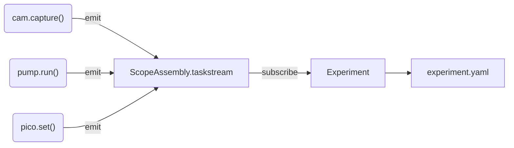

# Restructuring plan

!!! note "Provenance"
    This document was written by **Claude** (Anthropic), in conversation with
    Yatharth on 2026-09-05, as a working plan for restructuring the
    Trappy-Scopes CLI. It records decisions taken in that session, the state of
    the repository at the time, and the reasoning behind each proposed change.
    It is a plan, not a description of what exists — anything marked *proposed*
    or *deferred* has not been built.

---

## 1. The philosophy this is meant to serve

Trappy-Scopes has **two monolithic objects**:

- **`scope`** — the hardware. It is what generates data.
- **`exp`** — the experiment. It *drives* the scope and owns the data.

The synergy between them is what produces anything. At no point is the scope
meaningful by itself: the scope never runs a self-organised loop that collects
data without populating an experiment. It is the experiment's job to call the
scope to produce data.

This has one hard architectural consequence, from which most of this plan
follows:

!!! danger "The dependency rule"
    `expframework` may import from the hardware layer.
    The hardware layer may **never** import from `expframework`.

---

## 2. State of the repository (2026-09-05)

Findings from a survey of the tree, recorded here because several of them are
load-bearing for the plan.

### 2.1 The EXPENV hook already exists and is dead

`core/permaconfig/default_config.yaml:59` declares:

```yaml
startup_recipie: core.startup  # Startup procedure that defines how the CLI environment is created.
```

**No Python code reads this key.** The pluggable-environment design was
specified in the config schema and never implemented. Phase 3 is finishing
something already started, not inventing it.

### 2.2 `exec()`-based loading is the central structural problem

```
main.py:12          exec(open("core/startup/__init__.py").read())
  └─ startup:167    exec(open("core/startup/useractions.py").read())
```

This is not a style wart. It is *why* environments cannot be swapped: both
files only work because they are textually injected into `main.py`'s globals
and depend on names (`exp`, `scope`) already existing there. That is not
something you can select, parameterise, compose or test.

It also actively breaks ordinary Python. During this session, adding a single
normal `import` that touched `core.startup` caused the import machinery to
re-execute the whole startup file in a fresh namespace, which crashed at
`User.exp_hook = exp` with `NameError: name 'exp' is not defined`.

!!! important "The distinction that matters"
    `exec` for **user scripts** is fine and should stay — it is morally what
    `python script.py` does, and it is what keeps lab scripts dumb and
    readable. `exec` for **module loading** is what has to go. Nothing about
    fixing the second requires giving up the first. See §4.

### 2.3 Layering violations, and how contained they are

| Violation | Locations | Verdict |
|---|---|---|
| `core` → `expframework` / `hive` | all inside `core/startup/`, plus `core/argparser.py:128` | Fixed by a **move**, not a refactor |
| `detectors` → `expframework` | `detectors/cameras/abstractcamera.py:12`, `detectors/cameras/rpi_hq_picam2.py:28` | Inverts the dependency rule; fixed by §3 |

### 2.4 Byte-identical duplicate files

- `core/external/pyboard.py` == `utilities/pyboard.py` — **identical**, 909 lines each
- `core/utilities/fluff.py` == `utilities/fluff.py` — **identical**, 92 lines each
- `core/installer/installer.py` (138) vs `utilities/installer.py` (90) — **diverged**; someone edited one copy

### 2.5 Caveat for any pruning work

This codebase resolves classes from **dotted-path strings in YAML**
(`kind: detectors.cameras.nullcamera.Camera`) through `import_module`.
Static "who imports this" analysis therefore *undercounts*: a file can look
dead while being live in a deployed config on M1–M8. Nothing is deleted, and
no module is renamed, without grepping the YAML configs on every scope too.

---

## 3. Design: the device task stream

### 3.1 The problem

`detectors/cameras/*.py` imports `Experiment` so a camera can record when it
turned on and off. The instinct is right — **the hardware layer must be
self-documenting** — but the mechanism inverts the dependency rule.

### 3.2 The design

Invert the flow. The hardware does not reach up to the experiment; the
experiment reaches down and subscribes.



**One stream, on the assembly. Devices push. The experiment subscribes.**

A device emits whether or not an experiment exists. If nothing is subscribed,
events accumulate in a bounded ring buffer and nothing else happens — so the
scope still *works* standalone, while remaining not-meaningful standalone.
When an `Experiment` opens, it attaches to the stream and (optionally)
backfills what the ring buffer already holds.

### 3.3 Answering: per-device streams, merged?

**No — one central stream.** Per-device buffers would mean merging by
timestamp, which is exactly the "lot of computation" to be avoided, and it
makes live streaming impossible (you cannot merge a stream that has not ended).

The single exception is **remote devices** (RPyC over the network, the M1→M2
case). Those cannot append synchronously to a local list, so they buffer
locally and drain into the central stream, recording *both* clocks — the
remote emit time and the local receipt time — because the two machines'
clocks are not the same clock.

### 3.4 Answering: how do events register themselves?

An opt-in decorator, defined in the ABC layer, on the set of methods that
should record. Explicit, greppable, no magic, no cost on methods that do not
use it.

```python
# proposed: hive/recording.py  (later scopeparts/abc/recording.py)

class TaskStream:
    """Single-writer, append-only record of what the hardware did."""

    def __init__(self, maxlen=100_000):
        self._events = deque(maxlen=maxlen)   # bounded: long runs must not grow forever
        self._seq = itertools.count()         # atomic under the GIL
        self._sinks = []                      # Experiment attaches here

    def emit(self, event):
        event["seq"] = next(self._seq)
        event["machinetime"] = time.time_ns()
        self._events.append(event)
        for sink in self._sinks:
            try:
                sink(event)
            except Exception:
                log.exception("task sink failed")   # a bad sink never propagates
        return event


def records(kind="device_task"):
    """Mark a device method as one that registers itself on the task stream."""
    def decorator(fn):
        @functools.wraps(fn)
        def wrapper(self, *args, **kwargs):
            stream = getattr(self, "_taskstream", None)
            if stream is None:
                return fn(self, *args, **kwargs)      # standalone device still works
            start, ok, err = time.time_ns(), True, None
            try:
                return fn(self, *args, **kwargs)
            except BaseException as e:
                ok, err = False, repr(e)
                raise
            finally:
                try:
                    stream.emit({"type": kind, "device": getattr(self, "name", None),
                                 "task": fn.__name__, "start_ns": start,
                                 "end_ns": time.time_ns(), "ok": ok, "error": err})
                except Exception:
                    log.exception("task recording failed")   # never kills the call
        return wrapper
    return decorator
```

Usage stays trivial, and the camera stops importing `Experiment` entirely:

```python
class Camera(Detector):
    @records()
    def capture(self, action, name, **kwargs):
        ...
```

`ScopeAssembly.add_device()` injects the stream at mount time
(`deviceobj._taskstream = self.taskstream`), so nothing has to be wired by hand
per device.

### 3.5 Answering: aggregation

With one central stream, aggregation is free — there is nothing to merge.
Ordering is by `machinetime` (`time.time_ns()`, already the convention in
`ExpEvent` and `Measurement`) with the monotonic `seq` as tie-breaker. `seq`
also makes **dropped events detectable**: a gap in the sequence is a lost
record, which a timestamp alone would never reveal.

### 3.6 Safety

This runs a lab with pumps, lights and live cultures. The rules, in priority
order:

1. **Recording must never kill a hardware call.** Every emit is wrapped in
   `try/except` that logs and swallows. A full disk must not abort a perfusion.
   This is the single most important rule here.
2. **A failure must never go unrecorded.** `try/finally`, so an exception still
   emits before it propagates. A failed capture is scientifically meaningful.
3. **Emit must not block.** Append to memory only; flush to disk
   asynchronously. A synchronous write or network push inside `emit()` could
   stall an actuator control loop mid-operation.
4. **Bounded memory.** `deque(maxlen=…)`. `scripts/longterm/` runs for days;
   an unbounded list is an eventual OOM on a Raspberry Pi.
5. **Thread safety.** `ExpScheduler` already runs a background thread, and
   pumps and cameras may run in their own. `deque.append` is atomic under the
   GIL and `itertools.count()` is atomic — this is why they are used above
   rather than a plain list and an `n += 1` counter, which is a race.
6. **Drain on close.** `Experiment.close()` must drain the stream before
   writing final YAML, or the last events of every run are lost.
7. **Clock skew across machines** is recorded, never silently reconciled — see
   §3.3.

---

## 4. Design: EXPENV builders, and how scripts keep their globals

### 4.1 `main.py` stays trivial

```python
from core.permaconfig.config import TrappyConfig
from expenv import build

env = build(TrappyConfig())   # reads config.startup_recipie, returns a namespace
```

The recipe is a **function that returns a namespace**, not a file that mutates
an ambient one. That is the whole change, and it is what makes recipes
selectable, parameterisable and testable.

### 4.2 Answering: how to stop passing `globals()` to `ScriptEngine`

The reason `exec` was reached for is that **things need to live at the top
level** — a lab script should be able to say `scope.cam.capture(...)` with no
imports and no boilerplate. That requirement is correct and is not being given
up.

The trick is that the REPL's top level *is* a real, addressable namespace:
`__main__.__dict__`. So the builder merges into it explicitly —

```python
import __main__
vars(__main__).update(env)     # scope, exp, tools are now genuinely top-level
```

— and `ScriptEngine.run()` defaults to that namespace instead of being handed
one:

```python
def run(scripts=None, namespace=None, raise_exceptions=False):
    namespace = namespace if namespace is not None else vars(__main__)
    ...
    exec(source, namespace)
```

Which means:

- Scripts stay exactly as dumb as they are today — plain `.py`, top to bottom,
  `scope` and `exp` simply present. **No change to any existing script.**
- `ScriptEngine.run(globals(), ...)` becomes `ScriptEngine.run([...])`.
- `exec` is still used for scripts, on purpose. Only *module loading* by `exec`
  goes away.

This also closes a latent bug: today `ScriptEngine.run(globals_)` receives
`main.py`'s globals only as an accident of the `exec` chain, so a script that
rebinds `exp` does not reliably update anything else that holds it.

### 4.3 The recipes

| Recipe | Behaviour |
|---|---|
| **`freestyle`** | Today's behaviour: full scope assembly, experiment environment, all user tools, banners, tree, keybindings. The default, and the one for freestyling experiments. |
| **`raw`** | Minimal. Constructs the `ScopeAssembly` — hardware really does come up — and imports nothing else. Prints one line (`scope assembly created`), no banner, no device tree, no error summary. For calling the utility directly and then driving it by hand. |
| **`analysis`** | No hardware at all. See §4.4. |

### 4.4 On the analysis environment

This one is worth building because the payoff is **already designed and
unused**. The `Measurement` docstring in `expframework/measurement.py` states
the goal explicitly: a schema that "allows the user to combine an arbitrary
number of experiments for analysis, **without any data filtering**". Every
measurement already carries `eid`, `sid`, `scopeid`, `measureid`, `measureidx`
and three separate clocks. Nothing currently consumes that.

An `analysis` recipe would be the consumer:

- **Touches no hardware.** No serial ports, no `ScopeAssembly`, no RPyC server.
  Safe on a laptop, on the IGC cluster, or on any machine where the scope is
  physically absent.
- **Opens experiments read-only.** This needs a new path —
  `Experiment.__init__` currently creates directories, appends a session,
  `chdir`s and mutates `experiment.yaml`, none of which an analysis session
  should do. A read-only `Experiment.load(eid)` is a prerequisite.
- **Loads many experiments into one frame.** `df = load_experiments([...])`
  returning the concatenated measurement table — across scopes, across runs,
  across days. This is the thing the `Measurement` schema was built for.
- **Hands off to IPython/Jupyter** rather than owning a REPL loop, since there
  is no hardware to hold.

Prior art worth reading before building: the `exp-legacy-read` skill already
knows how to load legacy experiment directories, measurement streams and
day-level Metaexperiment logs. The analysis recipe should not reinvent that.

---

## 5. Revised phase plan

Order reflects decisions taken on 2026-09-05.

### Phase 0 — Replace `exec` module loading with an explicit namespace

The enabling change; nothing else is safely possible first.

- `main.py` calls a builder and merges the result into `__main__` (§4.1, §4.2).
- `ScriptEngine.run()` defaults to `vars(__main__)`; stop passing `globals()`.
- **No script changes. No user-visible behaviour change.**

### Phase 1 — Mechanical moves, zero behaviour change

- `core/startup/` → `expenv/` — this alone removes the `core` → `expframework`
  violation.
- Fix `core/argparser.py:128`.
- Delete the two byte-identical duplicates (§2.4).
- Move `gui/fim.py` into `utilities/`.
- **Explicitly out of scope: `installer.py`.** The diverged copies are a
  symptom of an unsolved problem — how installation should work at all — and
  that needs its own plan. Not touched here.
- **Checkpoint:** `core` imports nothing above it, enforced by a CI grep so it
  cannot regress.

### Phase 2 — Task stream (§3)

- `TaskStream` + `@records` in the ABC layer.
- `ScopeAssembly` owns one stream and injects it at `add_device`.
- `Experiment` subscribes on open, drains on close.
- **Cameras stop importing `Experiment`** — the violation in §2.3 disappears.
- This is additive: it does not move or rename any module.

### Phase 3 — EXPENV for real (§4)

- Read `config.startup_recipie` and dispatch (the key already exists, §2.1).
- Ship `freestyle`, `raw`, `analysis`.
- `useractions` splits into explicitly registered tools rather than an
  `exec`'d blob; keybindings become a tool a recipe opts into.

### Phase 4 — Eviction and pruning

- `pico_firmware/` → its own repository. It is MicroPython, for a different
  interpreter on different hardware; it is not part of this package.
- `gui/` → delete if it is empty of anything real.
- `optics/` → **retained**, and eventually folded into the hardware layer
  alongside actuators, detectors, assemblies and monitors.
- Prune dead code against **both** Python imports and YAML `kind:` strings
  (§2.5). First candidates: `_to_delete/`, `optics/old_cli/`, `gui/dev/`,
  `utilities/autocompleter.py`.

### Phase 5 (last) — `hive` → `scopeparts`

**Deliberately deferred to the end.** This is the most essential and most
invasive change, and further work is expected to land on top of it that could
change the shape again. Renaming early means renaming twice.

Sketch, for when it happens:

```
scopeparts/
├── abc/          # the pure interfaces — this is what `hive` was meant to be
│   └── BaseDevice, Actuator, Detector, Monitor, TaskStream, @records
├── assembly.py   # ScopeAssembly
├── processors/   # linux, micropython, remote transport
├── actuators/    # implementations (was actuators/)
├── detectors/    # implementations (was detectors/)
├── optics/       # (was optics/)
└── network/      # rpyc, mqtt, exchange
```

The tension to resolve: `actuators/` and `detectors/` provide
*implementations*, while `hive` was meant to be *abstract* — but `hive` also
carries a lot of concrete MicroPython and serial code. The split above puts
interfaces in `abc/` and transport in `processors/`, which is what makes the
absorption coherent rather than just a bigger pile.

!!! warning "Migration cost"
    This phase rewrites every `kind:` dotted path in every deployed YAML on
    every scope. It needs either an alias map from old paths to new, or a
    config migration script — otherwise M1–M8 break on their next `git pull`.
    This cost is the main reason it goes last.

---

## 6. Open questions

- **Installers.** Two diverged copies and no agreed model. Needs its own plan.
- **`utilities/`** is doing too much and is not really a category. Left alone
  for now; worth revisiting after Phase 4.
- **`scripts/`** stays in-tree — a small curated script module is genuinely
  useful here — but the boundary between "example" and "production protocol"
  is undefined.
