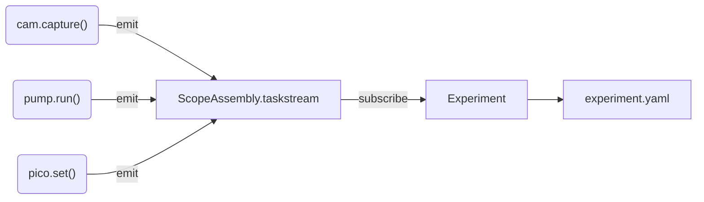

# Restructuring plan

!!! note "Provenance"
    This document was written by **Claude** (Anthropic), in conversation with
    Yatharth on 2026-09-05, as a working plan for restructuring the
    Trappy-Scopes CLI. It records decisions taken in that session, the state of
    the repository at the time, and the reasoning behind each proposed change.

!!! success "Status — 2026-09-05, branch `restructure-20260905`"
    **Phases 0, 1 and 3 are done.** Phases 2, 4 and 5 are not started, and
    §3 (task stream), the ScriptEngine rework and the `analysis` recipe were
    explicitly deferred. Each phase in §5 carries its own status line.

    The boot has **not** been verified end-to-end — see §5 Phase 0/3 for
    exactly what was and was not tested.

---

## 1. The philosophy this is meant to serve

Trappy-Scopes has **two monolithic objects**:

- **`scope`** — the hardware. It is what generates data.
- **`exp`** — the experiment. It *drives* the scope and owns the data.

The synergy between them is what produces anything. At no point is the scope
meaningful by itself: the scope never runs a self-organised loop that collects
data without populating an experiment. It is the experiment's job to call the
scope to produce data.

This has one hard architectural consequence, from which most of this plan
follows:

!!! danger "The dependency rule"
    `expframework` may import from the hardware layer.
    The hardware layer may **never** import from `expframework`.

---

## 2. State of the repository (2026-09-05)

Findings from a survey of the tree, recorded here because several of them are
load-bearing for the plan.

### 2.1 The EXPENV hook already existed and was dead ✅ *now live*

`core/permaconfig/default_config.yaml:59` declared:

```yaml
startup_recipie: core.startup  # Startup procedure that defines how the CLI environment is created.
```

**No Python code read this key.** The pluggable-environment design was
specified in the config schema and never implemented. Phase 3 finished
something already started, rather than inventing it.

As of Phase 3, `expenv.build()` reads this key. The legacy value
`core.startup` is mapped to `freestyle`, so configs already deployed on the
scopes keep working without edits.

### 2.2 `exec()`-based loading was the central structural problem ✅ *removed*

```
main.py:12          exec(open("core/startup/__init__.py").read())
  └─ startup:167    exec(open("core/startup/useractions.py").read())
```

This was not a style wart. It was *why* environments could not be swapped:
both files only worked because they were textually injected into `main.py`'s
globals and depended on names (`exp`, `scope`) already existing there. That is
not something you can select, parameterise, compose or test.

It also actively breaks ordinary Python. During this session, adding a single
normal `import` that touched `core.startup` caused the import machinery to
re-execute the whole startup file in a fresh namespace, which crashed at
`User.exp_hook = exp` with `NameError: name 'exp' is not defined`.

!!! important "The distinction that matters"
    `exec` for **user scripts** is fine and should stay — it is morally what
    `python script.py` does, and it is what keeps lab scripts dumb and
    readable. `exec` for **module loading** is what has to go. Nothing about
    fixing the second requires giving up the first. See §4.

### 2.3 Layering violations, and how contained they are

| Violation | Locations | Status |
|---|---|---|
| `core` → `expframework` / `hive` | all inside `core/startup/`, plus `core/argparser.py:128` | ✅ **Fixed** (Phases 0/1). `core` has no upward imports; enforce with a CI grep. |
| `detectors` → `expframework` | `detectors/cameras/abstractcamera.py:12`, `detectors/cameras/rpi_hq_picam2.py:28` | ⏳ Open — inverts the dependency rule; fixed by §3, deferred |

### 2.4 Byte-identical duplicate files

- `core/external/pyboard.py` == `utilities/pyboard.py` — **identical**, 909 lines each ✅ *`utilities/` copy deleted; `core/external/` is the one `hive` imports*
- `core/utilities/fluff.py` == `utilities/fluff.py` — **identical**, 92 lines each ✅ *`core/` copy deleted; see the lesson in §2.5*
- `core/installer/installer.py` (138) vs `utilities/installer.py` (90) — **diverged**; someone edited one copy ⏳ *deliberately untouched, needs its own plan*

### 2.5 Caveat for any pruning work

**Two blind spots, both of which have now drawn blood.**

1. **YAML dotted paths.** This codebase resolves classes from strings in
   config (`kind: detectors.cameras.nullcamera.Camera`) through
   `import_module`. Static "who imports this" analysis *undercounts*: a file
   can look dead while being live in a deployed config on M1–M8.

2. **Relative imports.** In Phase 1 `core/utilities/fluff.py` was deleted
   after grepping for `core.utilities` and finding nothing. It was reached by
   `core/permaconfig/config.py` as `from ..utilities import fluff` — which no
   absolute-path grep matches. It broke the whole config import chain and was
   caught only by actually trying to import the recipes.

!!! warning "Rule"
    Nothing is deleted, and no module is renamed, without grepping for the
    absolute path, the **relative** form (`from ..x`, `from .x`), and the
    YAML `kind:` strings on every scope — and then actually importing the
    affected modules.

---

## 3. Design: the device task stream

### 3.1 The problem

`detectors/cameras/*.py` imports `Experiment` so a camera can record when it
turned on and off. The instinct is right — **the hardware layer must be
self-documenting** — but the mechanism inverts the dependency rule.

### 3.2 The design

Invert the flow. The hardware does not reach up to the experiment; the
experiment reaches down and subscribes.



**One stream, on the assembly. Devices push. The experiment subscribes.**

A device emits whether or not an experiment exists. If nothing is subscribed,
events accumulate in a bounded ring buffer and nothing else happens — so the
scope still *works* standalone, while remaining not-meaningful standalone.
When an `Experiment` opens, it attaches to the stream and (optionally)
backfills what the ring buffer already holds.

### 3.3 Answering: per-device streams, merged?

**No — one central stream.** Per-device buffers would mean merging by
timestamp, which is exactly the "lot of computation" to be avoided, and it
makes live streaming impossible (you cannot merge a stream that has not ended).

The single exception is **remote devices** (RPyC over the network, the M1→M2
case). Those cannot append synchronously to a local list, so they buffer
locally and drain into the central stream, recording *both* clocks — the
remote emit time and the local receipt time — because the two machines'
clocks are not the same clock.

### 3.4 Answering: how do events register themselves?

An opt-in decorator, defined in the ABC layer, on the set of methods that
should record. Explicit, greppable, no magic, no cost on methods that do not
use it.

```python
# proposed: hive/recording.py  (later scopeparts/abc/recording.py)

class TaskStream:
    """Single-writer, append-only record of what the hardware did."""

    def __init__(self, maxlen=100_000):
        self._events = deque(maxlen=maxlen)   # bounded: long runs must not grow forever
        self._seq = itertools.count()         # atomic under the GIL
        self._sinks = []                      # Experiment attaches here

    def emit(self, event):
        event["seq"] = next(self._seq)
        event["machinetime"] = time.time_ns()
        self._events.append(event)
        for sink in self._sinks:
            try:
                sink(event)
            except Exception:
                log.exception("task sink failed")   # a bad sink never propagates
        return event


def records(kind="device_task"):
    """Mark a device method as one that registers itself on the task stream."""
    def decorator(fn):
        @functools.wraps(fn)
        def wrapper(self, *args, **kwargs):
            stream = getattr(self, "_taskstream", None)
            if stream is None:
                return fn(self, *args, **kwargs)      # standalone device still works
            start, ok, err = time.time_ns(), True, None
            try:
                return fn(self, *args, **kwargs)
            except BaseException as e:
                ok, err = False, repr(e)
                raise
            finally:
                try:
                    stream.emit({"type": kind, "device": getattr(self, "name", None),
                                 "task": fn.__name__, "start_ns": start,
                                 "end_ns": time.time_ns(), "ok": ok, "error": err})
                except Exception:
                    log.exception("task recording failed")   # never kills the call
        return wrapper
    return decorator
```

Usage stays trivial, and the camera stops importing `Experiment` entirely:

```python
class Camera(Detector):
    @records()
    def capture(self, action, name, **kwargs):
        ...
```

`ScopeAssembly.add_device()` injects the stream at mount time
(`deviceobj._taskstream = self.taskstream`), so nothing has to be wired by hand
per device.

### 3.5 Answering: aggregation

With one central stream, aggregation is free — there is nothing to merge.
Ordering is by `machinetime` (`time.time_ns()`, already the convention in
`ExpEvent` and `Measurement`) with the monotonic `seq` as tie-breaker. `seq`
also makes **dropped events detectable**: a gap in the sequence is a lost
record, which a timestamp alone would never reveal.

### 3.6 Safety

This runs a lab with pumps, lights and live cultures. The rules, in priority
order:

1. **Recording must never kill a hardware call.** Every emit is wrapped in
   `try/except` that logs and swallows. A full disk must not abort a perfusion.
   This is the single most important rule here.
2. **A failure must never go unrecorded.** `try/finally`, so an exception still
   emits before it propagates. A failed capture is scientifically meaningful.
3. **Emit must not block.** Append to memory only; flush to disk
   asynchronously. A synchronous write or network push inside `emit()` could
   stall an actuator control loop mid-operation.
4. **Bounded memory.** `deque(maxlen=…)`. `scripts/longterm/` runs for days;
   an unbounded list is an eventual OOM on a Raspberry Pi.
5. **Thread safety.** `ExpScheduler` already runs a background thread, and
   pumps and cameras may run in their own. `deque.append` is atomic under the
   GIL and `itertools.count()` is atomic — this is why they are used above
   rather than a plain list and an `n += 1` counter, which is a race.
6. **Drain on close.** `Experiment.close()` must drain the stream before
   writing final YAML, or the last events of every run are lost.
7. **Clock skew across machines** is recorded, never silently reconciled — see
   §3.3.

---

## 4. Design: EXPENV builders, and how scripts keep their globals

### 4.1 `main.py` stays trivial

```python
from core.permaconfig.config import TrappyConfig
from expenv import build

env = build(TrappyConfig())   # reads config.startup_recipie, returns a namespace
```

The recipe is a **function that returns a namespace**, not a file that mutates
an ambient one. That is the whole change, and it is what makes recipes
selectable, parameterisable and testable.

### 4.2 Answering: how to stop passing `globals()` to `ScriptEngine`

The reason `exec` was reached for is that **things need to live at the top
level** — a lab script should be able to say `scope.cam.capture(...)` with no
imports and no boilerplate. That requirement is correct and is not being given
up.

The trick is that the REPL's top level *is* a real, addressable namespace:
`__main__.__dict__`. So the builder merges into it explicitly —

```python
import __main__
vars(__main__).update(env)     # scope, exp, tools are now genuinely top-level
```

— and `ScriptEngine.run()` defaults to that namespace instead of being handed
one:

```python
def run(scripts=None, namespace=None, raise_exceptions=False):
    namespace = namespace if namespace is not None else vars(__main__)
    ...
    exec(source, namespace)
```

Which means:

- Scripts stay exactly as dumb as they are today — plain `.py`, top to bottom,
  `scope` and `exp` simply present. **No change to any existing script.**
- `ScriptEngine.run(globals(), ...)` becomes `ScriptEngine.run([...])`.
- `exec` is still used for scripts, on purpose. Only *module loading* by `exec`
  goes away.

This also closes a latent bug: today `ScriptEngine.run(globals_)` receives
`main.py`'s globals only as an accident of the `exec` chain, so a script that
rebinds `exp` does not reliably update anything else that holds it.

### 4.3 The recipes

| Recipe | Behaviour |
|---|---|
| **`freestyle`** | Today's behaviour: full scope assembly, experiment environment, all user tools, banners, tree, keybindings. The default, and the one for freestyling experiments. |
| **`raw`** | Minimal. Constructs the `ScopeAssembly` — hardware really does come up — and imports nothing else. Prints one line (`scope assembly created`), no banner, no device tree, no error summary. For calling the utility directly and then driving it by hand. |
| **`analysis`** | No hardware at all. See §4.4. |

### 4.4 On the analysis environment

This one is worth building because the payoff is **already designed and
unused**. The `Measurement` docstring in `expframework/measurement.py` states
the goal explicitly: a schema that "allows the user to combine an arbitrary
number of experiments for analysis, **without any data filtering**". Every
measurement already carries `eid`, `sid`, `scopeid`, `measureid`, `measureidx`
and three separate clocks. Nothing currently consumes that.

An `analysis` recipe would be the consumer:

- **Touches no hardware.** No serial ports, no `ScopeAssembly`, no RPyC server.
  Safe on a laptop, on the IGC cluster, or on any machine where the scope is
  physically absent.
- **Opens experiments read-only.** This needs a new path —
  `Experiment.__init__` currently creates directories, appends a session,
  `chdir`s and mutates `experiment.yaml`, none of which an analysis session
  should do. A read-only `Experiment.load(eid)` is a prerequisite.
- **Loads many experiments into one frame.** `df = load_experiments([...])`
  returning the concatenated measurement table — across scopes, across runs,
  across days. This is the thing the `Measurement` schema was built for.
- **Hands off to IPython/Jupyter** rather than owning a REPL loop, since there
  is no hardware to hold.

Prior art worth reading before building: the `exp-legacy-read` skill already
knows how to load legacy experiment directories, measurement streams and
day-level Metaexperiment logs. The analysis recipe should not reinvent that.

---

## 5. Revised phase plan

Order reflects decisions taken on 2026-09-05.

### Phase 0 — Replace `exec` module loading with an explicit namespace ✅ done

*Commit `363a347`.* The enabling change; nothing else was safely possible first.

- `main.py` calls a builder and merges the result into `__main__` (§4.1, §4.2).
  It is now two lines.
- **Deferred:** `ScriptEngine.run()` still takes an explicit namespace argument
  rather than defaulting to `vars(__main__)`. The recipe passes it the
  namespace it just built, so no script changed — but the ScriptEngine rework
  in §4.2 has not been done.
- One constraint the script→function conversion forced: `from core.argparser
  import *` had to become a plain import, because **`import *` is a
  SyntaxError inside a function**. `Share` is now imported explicitly.

### Phase 1 — Mechanical moves, zero behaviour change ✅ done

*Commit `6cdef3f`.*

- `core/startup/` → `expenv/` — this alone removed the `core` → `expframework`
  violation.
- Fixed `core/argparser.py:128`: it records the scriptlist in `Share.argparse`
  and the recipe hands it to the ScriptEngine.
- Deleted the two byte-identical duplicates (§2.4) — one of which broke the
  build via a relative import; see the lesson in §2.5.
- Moved `gui/fim.py` into `utilities/` (+5 import sites in `scripts/`).
- **Explicitly out of scope: `installer.py`.** The diverged copies are a
  symptom of an unsolved problem — how installation should work at all — and
  that needs its own plan. Not touched.
- **Checkpoint met:** `core` imports nothing above it. Still worth a CI grep so
  it cannot regress.

### Phase 2 — Task stream (§3) ⏳ deferred

- `TaskStream` + `@records` in the ABC layer.
- `ScopeAssembly` owns one stream and injects it at `add_device`.
- `Experiment` subscribes on open, drains on close.
- **Cameras stop importing `Experiment`** — the violation in §2.3 disappears.
- This is additive: it does not move or rename any module.

### Phase 3 — EXPENV for real (§4) ✅ done (minus `analysis`)

*Commit `363a347`.*

- `expenv.build()` reads `config.startup_recipie` and dispatches. Accepts a
  short name, a full dotted path to any module exposing `build(config)`, or the
  legacy `core.startup` → `freestyle` (§2.1).
- Shipped `freestyle` and `raw`. **`analysis` deferred** — it needs a read-only
  `Experiment.load(eid)` first (§4.4).
- `useractions` is imported rather than `exec`'d, and gained the
  `ScopeAssembly` import it always referenced but never had. **It has not been
  split into separately registered tools** — that part of the phase is
  outstanding.

!!! warning "Not verified by booting"
    The CLI was not started end-to-end: startup opens serial ports, starts an
    RPyC server and can mount SMB shares. `expenv`, `raw` and `useractions`
    import cleanly and all recipes compile and resolve, but `freestyle`'s
    import chain cannot complete on a machine without `pypandoc`, `reportlab`
    and `html2rml` — imported unconditionally by `expframework/report.py`, on
    `main` too, so pre-existing rather than a regression. **Boot on a real
    scope before trusting this.**

### Phase 4 — Eviction and pruning ⏳ not started

- `pico_firmware/` → its own repository. It is MicroPython, for a different
  interpreter on different hardware; it is not part of this package.
- `gui/` → delete if it is empty of anything real.
- `optics/` → **retained**, and eventually folded into the hardware layer
  alongside actuators, detectors, assemblies and monitors.
- Prune dead code against **both** Python imports and YAML `kind:` strings
  (§2.5). First candidates: `_to_delete/`, `optics/old_cli/`, `gui/dev/`,
  `utilities/autocompleter.py`.

### Phase 5 (last) — `hive` → `scopeparts` ⏳ not started

**Deliberately deferred to the end.** This is the most essential and most
invasive change, and further work is expected to land on top of it that could
change the shape again. Renaming early means renaming twice.

Sketch, for when it happens:

```
scopeparts/
├── abc/          # the pure interfaces — this is what `hive` was meant to be
│   └── BaseDevice, Actuator, Detector, Monitor, TaskStream, @records
├── assembly.py   # ScopeAssembly
├── processors/   # linux, micropython, remote transport
├── actuators/    # implementations (was actuators/)
├── detectors/    # implementations (was detectors/)
├── optics/       # (was optics/)
└── network/      # rpyc, mqtt, exchange
```

The tension to resolve: `actuators/` and `detectors/` provide
*implementations*, while `hive` was meant to be *abstract* — but `hive` also
carries a lot of concrete MicroPython and serial code. The split above puts
interfaces in `abc/` and transport in `processors/`, which is what makes the
absorption coherent rather than just a bigger pile.

!!! warning "Migration cost"
    This phase rewrites every `kind:` dotted path in every deployed YAML on
    every scope. It needs either an alias map from old paths to new, or a
    config migration script — otherwise M1–M8 break on their next `git pull`.
    This cost is the main reason it goes last.

---

## 6. Open questions

- **Installers.** Two diverged copies and no agreed model. Needs its own plan.
- **`utilities/`** is doing too much and is not really a category. Left alone
  for now; worth revisiting after Phase 4.
- **`ScopeAssembly.close()` crashes at exit when no assembly was built.** The
  `atexit` handler at `hive/assembly.py:72` iterates
  `ScopeAssembly.current.devices` without checking that `current` is set, so
  any process that imports the assembly and exits without building one dies
  with `AttributeError: 'NoneType' object has no attribute 'devices'`.
  Pre-existing; a one-line guard.
- **Report dependencies are unconditional.** `expframework/report.py` imports
  `pypandoc`, `reportlab` and `html2rml` at module scope, and
  `Experiment` imports `ExpReport`, so a machine without those three cannot
  import `Experiment` at all. Since `exp_report` is a config flag that
  defaults to `false`, these should be imported lazily.
- **`scripts/`** stays in-tree — a small curated script module is genuinely
  useful here — but the boundary between "example" and "production protocol"
  is undefined.

---

## 7. The configuration layer

Decisions taken 2026-09-05. The agreed order of work is **bottom-up**: settle
the configuration layer first, then let the experiment and the scope inherit
those changes.

!!! danger "`default_config.yaml` is the master document, and it does not boot"
    The template is the file copied to a new scope, so it is the spec. But it
    has drifted from both the code and every deployed config:

    | `default_config.yaml` says | Code reads | Live configs use |
    |---|---|---|
    | `ScopeAssembly:` | `scopeconfig["devices"]` | `devices:` |
    | `Experiment.exp_dir` | `config["config"]["expdir"]` | `config.expdir` |
    | `Experiment.file_server` | `config["config"]["file_server"]` | `config.file_server` |
    | `config.git_sync.repos` | `config["config"]["git_dependencies"]` | `config.git_dependencies` |
    | *(absent)* | `config["Experiment"]["scripts_dirs"]` | `Experiment.scripts_dirs` |

    The code and the eight deployed scopes agree with each other; the template
    and the README are the outliers. Copying `default_config.yaml` to a new
    scope today raises `KeyError: 'devices'` and mounts nothing.

    **Fix direction: bring the template up to what the code and the working
    scopes do.** Changing the code to match the template would break M1–M8.

    The README is a design document — wishful thinking, not a spec. Where the
    two disagree, the template wins; where the template and the code disagree,
    the code and the live configs win until deliberately migrated.

!!! success "Correction — 2026-09-05, later the same day"
    The above was backwards. `default_config.yaml` **is** the file that gets
    copied to a new scope as its `trappyconfig.yaml` — it is the template on
    purpose, and it not booting is a known, accepted state, not a bug to
    reflexively fix by reverting it to match the old convention. The
    `ScopeAssembly:` / `Experiment.exp_dir` / `Experiment.file_server` shape it
    describes **is the intended direction**: the newer, more structured format
    from the README, and it is what gets implemented. The live config and the
    code are the legacy convention, not the ground truth to preserve.

    So the fix direction reverses: **bring `ScopeAssembly.open()` and
    `Experiment` up to what the template already describes**, not the other
    way around. §11 tabulates every field across all four sources found
    (live config, template, README, and a fourth reference copy this session
    turned up); §12 tabulates exactly where the code breaks and what changes,
    for review before anything is executed.

Two more drifts of the same kind, both currently harmless by accident:

- `assembly.py:64` reads `scopeconfig["abstractions"]` (plural); live configs
  write `abstraction:` (singular). Dead only because `freestyle` calls
  `ScopeAssembly(scopeid)` with no config, so the branch never executes.
- At least one live config declares `lit` at top level rather than under
  `devices:`, so it never mounts.

### 7.1 `active:` belongs in TrappyConfig, not in each consumer

Today `active:` is honoured ad hoc: `ExpSync` checks `file_server.active`,
while `startup.py:12` does `if scopeconfig["config"]["git_sync"]:` on a dict,
which is always truthy — so `git_sync.active: false` is silently ignored. For
devices nothing checks it at all.

**Decision:** implement it once, at the `TrappyConfig` level. A block with
`active: false` is simply *not exposed* by the config object — it is still in
the file, but consumers never see it. Absence of the key means `true`.

Consequence to handle deliberately: this lets a user disable configuration
that is actually required (an experiment directory, say), and the failure
would otherwise be silent. So a missing-but-required block must raise a clear
warning naming what was disabled. `confuse` may already have a mechanism for
this — check before hand-rolling.

### 7.2 `config_redact_fields`, and what actually gets synced

Documented, never implemented, and it matters: the `config_server` block
rsyncs `trappyconfig.yaml` — which holds `username`/`password` in cleartext —
to a share.

**Intent:** when a *copy* of the `TrappyConfig` object is requested, the
redacted fields are omitted. The motivating case is that **every experiment
should carry a copy of the configuration it ran under**, so a run is
reproducible from its own directory — but that copy must not carry the
passwords or server addresses.

**Superseded 2026-09-05: the sync target is the whole `~/trappyverse/`
directory, not one file.** Config profiles are only one thing that lives
there — device histories, databases, and shelves belong alongside them, and
should be backed up the same way. **Decided:** a single `rsync` over the
whole directory, run in both directions, keeping the latest copy of each
file (`--update`/`-u` semantics both ways — pull then push, or push then
pull; `-u` refuses to overwrite a newer file on the receiving side either
way). Considered and rejected: splitting the directory by subfolder with a
fixed direction per subfolder (config authored centrally and pulled,
device state generated locally and pushed) — simpler to reason about, but
not what was chosen.

**One caveat worth knowing, not yet a blocker:** "latest copy" means latest
by modification time, compared across machines that don't share a clock. If
a scope's clock has drifted, an older edit with a newer mtime can still win.
Not addressed now; worth a note if syncs ever produce a surprising result.

**Follow-on, applied 2026-09-05:** `PhysicalObject`'s persistent `shelve`
state (`hive/physical.py`, used by any device with `persistent: true` --
`trap` in the live config) wrote directly to `~/<name>`, outside
`trappyverse/` entirely, so folder-level sync would never have backed it up.
Moved to `~/trappyverse/state/<name>`. **Not migrated automatically:** a
shelve file from before this change, sitting at the old `~/<name>` path, is
not picked up -- move it under `trappyverse/state/` by hand if it needs to
survive.

### 7.3 The launcher (`./trappyscope`)

`git_sync` was never enabled because there was no correct place to call it:
it has to happen *before* the code launches, before the scope is constructed,
before the experiment environment is built. That is a layer that does not
exist yet. The `./trappyscope` script was the beginning of it.

**2026-09-05: built, twice.** First pass wired the entry point
(`pyproject.toml`'s `trappyscope = "trappyscopes.main:main"` was broken — the
target module didn't exist) but got the launcher's own scope wrong: its menu
included opening a specific experiment and queueing a script, which are scope
CLI concerns, and its UI (`prompt_toolkit`, full-screen) needed ~46 rows × 80
cols and just showed "window too small" on an ordinary terminal.

Both corrected. **The launcher is a layer above the scope CLI — it never
opens an experiment or runs a script itself** (`launcher/utilities/boot.py`
is the one place that responsibility hands off to `expenv.build()`). And the
UI is `rich.live.Live(screen=False)`, not `prompt_toolkit`: it repaints a
small, centered block in place — animation, title, menu — with no
minimum-terminal-size gate, which is what the previous version actually
needed fixed (the layout wasn't the bug; the full-screen library was).
Keystrokes are read via stdlib `tty.setcbreak()` + `select()` polling so the
animation keeps looping between keystrokes, for as long as the menu is open.

Steps 0-4 below are now substantially built, as `launcher/utilities/`:

- **`trappyscope`** (bare) and the menu's **"Launch normally"** are the same
  code (`launch_normally.run()`): check config → sync config (if configured)
  → re-check → repository status/sync → hand off.
- **`trappyscope --launcher`** — the menu, also offering each step
  standalone: **check configuration file** (YAML syntax only, `PyYAML`'s own
  `problem_mark` gives the line/column — no schema-validation library
  needed), **sync configuration file** (§7.2, via the now-general
  `core/sync.py`, namespaced per scope), **repository utility** (status
  table for everything in `config.git_dependencies`, via `GitPython` — not
  new, already used in `core/bookkeeping/session.py` for the per-session
  commit id — confirm before pulling), plus **install/setup, show the
  intro, edit the config**, deferred, wrapping what already existed.

Still open: **step 0, environment activation**, not addressed by either
build. `core/sync.py` (new, replacing a dead `SyncEngine` stub) is the
shared rsync/mount primitive now used by both this and `ExpSync`.

**Order, revised 2026-09-05 — reasoned through, not the order first proposed:**

0. **Activate the declared environment, first.** The `venv` block already
   exists in the template. This has to happen before anything else because
   the *later* steps are themselves Python — the config validator included —
   so the correct interpreter has to be running before step 1 can even import
   its own dependencies. Must be package-manager agnostic — conda here,
   possibly plain `venv` elsewhere — so it needs a crude, general method of
   finding the right Python rather than a clean one.
1. **Validate the configuration and produce a readable traceback.** Raw
   `PyYAML` errors do not say *where* the mistake is, which makes a broken
   config painful to diagnose on a headless scope. Worth pulling in a schema
   validation library rather than hand-rolling.
2. **Sync the configuration with the config server**, before git-sync — not
   after. Reasoning: the *remote* configuration is the one that says whether
   git-sync should even run. If step 4 ran first, a scope could git-sync on
   stale instructions from a config the server has since changed (e.g.
   git-sync was deliberately disabled remotely). Read the server address from
   the local config, ask whether the stored configuration has changed, and if
   so rewrite the local file.
3. **Re-validate.** Resolves the gap step 2 opens: a file rewritten from the
   server has not itself been checked. Re-run step 1's validator against the
   freshly-written file before anything acts on it — otherwise a corrupt push
   to the config server would brick every scope that syncs it, silently, on
   its next boot. Confirmed as its own step rather than a loop-back into step
   1, so a bad fetch fails loudly right here instead of somewhere later.
4. **Git-sync the declared repositories**, including this codebase, now
   acting on whatever step 2 left in place and step 3 confirmed was sound.

---

## 8. Device coercion — `metaclass`, `read_method`, `write_method`

**Noted, not scheduled.** These are optional and explicitly not being built
yet; this section exists so the design is not lost.

The purpose is the project's central claim — *"seamlessly interfaces with any
existing python package"*. Today `kind:` must point at a class that already
has the right shape, so integrating a foreign library means hand-writing a
wrapper. The coercion mechanism removes that: **you should not need to write
a wrapper for most foreign code.**

`kind:` calls a constructor, and that is all that is required. On top of that:

- **`read_method` / `write_method` alias a foreign method into the Trappy
  contract.** Calling `read()` on an object that has no `read()` dispatches to
  whatever method the config named. The declared `args`/`kwargs` are bound
  with `functools.partial`.
- **Declaring them elevates the object** into a detector or an actuator.
- **`metaclass:` declares intent, and is validated against the methods:**

    | Declared metaclass | Requires |
    |---|---|
    | detector | `read_method` |
    | actuator | `read_method` **and** `write_method` |

    A declaration that does not meet its requirement is a configuration
    error, caught at mount time rather than at first use.

- A **`config_method`** is wanted on the same principle.

This belongs in the scope-parts layer, alongside the ABCs.

---

## 9. `tree` and `devices` are not the same thing

They are currently two flat dicts holding identical objects, which is why the
distinction looks redundant. It is not — it was never finished.

- **`devices`** is the flat list of devices attached to the scope.
- **`tree`** is meant to be *structured*. Proxy devices constructed by another
  device belong inside that device's namespace: the objects `scope.pico`
  creates during handshake should live under `pico`, not at top level.

### 9.1 Aggregates

The tree should also carry **aggregate nodes**. Given four motors mounted as
`scope.motor1` … `scope.motor4`, an aggregate `set` becomes a node covering
all four, so that `scope.set.stop()` stops every motor in it — one call
fanning out across the group, while the individual devices remain
addressable.

This already exists as `ActionSet` in `pico_firmware`, but it is hardcoded:
the motors are declared into the group by hand at construction. Membership has
to be declared *somewhere*, but it should not have to be hardcoded — and for
the proxy objects a device creates during handshake, it can be derived
automatically.

### 9.2 Smaller fixes agreed

- **Device names need a guard.** `add_device` does `setattr(self, name, obj)`
  with no check, so a device called `open`, `close` or `devices` silently
  overwrites the assembly's own API. Either reject names that collide with an
  existing attribute, or keep a reserved-word list — undecided which is
  better.
- ~~**`abstraction` goes.**~~ **Reopened 2026-09-05 — see §9.3.** The old
  role-mapping concept (one device set, reinterpreted) is still going. What's
  reopened is whether the *keyword* gets reused for a new, unrelated purpose:
  selecting among multiple, disjoint hardware profiles in one config.
- **The hardcoded `sys.path.append` at `assembly.py:112` goes.** It points at
  one machine and contains a stray quote, so it has never done anything.
- **`__device_type__`** was never made to work. It stays unimplemented rather
  than half-present.

### 9.3 Resolved: no `abstraction:` keyword — separate config files instead

Motivation: one setup should be able to describe more than one hardware
topology (a microscope vs. a computing-cluster node), selected rather than
merged. The nested-dict-plus-selector grammar originally proposed:

```yaml
abstraction: microscope   # selector
ScopeAssembly:
  microscope: {cam: {...}}
  cluster:    {pico1: {...}}
```

**Decided 2026-09-05: dropped, in favour of separate files** —
`trappyconfig.microscope.yaml`, `trappyconfig.cluster.yaml`, common
`Experiment:`/`config:` in a shared base, composed via `TrappyConfig`'s
existing (unused) `confuse` source-layering through `config.config_files`.
Each file is independently valid; there's no grammar whose shape depends on
a sibling key, and so no version of the confusing mid-construction
`KeyError` the nested form risked. These files live inside the
`trappyverse/` folder along with everything else synced per §7.2.

The concerns that led here, kept for the record:

1. **Naming collision.** `abstraction:` already meant something else in this
   codebase's history (§2's live-config role-map, `__abstraction__()`) —
   reusing the word for "select a disjoint profile" is a different concept
   wearing the old name. If kept, document it as a deliberate rename of
   meaning, not a revival.
2. **Grammar ambiguity.** `ScopeAssembly:`'s shape (flat device list vs.
   nested-by-profile) would depend on whether the sibling `abstraction:` key
   exists. Forgetting it doesn't fail cleanly — `open()` tries to read a
   profile's device dict as if it were one device, producing a confusing
   `KeyError` deep in construction. Exactly the failure mode §7.3 step 1
   exists to prevent. Since nothing live uses `ScopeAssembly:` yet, there's no
   migration cost to choosing an unambiguous grammar instead (e.g. always
   nested-by-name; a selector required only when more than one name exists).
3. **Alternative: this may already be solved.** `core/permaconfig/config.py:53-61`
   shows `TrappyConfig` already layers `confuse` sources — default, the
   scope's file, then each entry in `config.config_files: []` (stubbed in the
   template, never populated in any live config). A file-per-profile design
   (`trappyconfig.microscope.yaml`, `trappyconfig.cluster.yaml`, common
   `Experiment:`/`config:` in a shared base) reuses working infrastructure
   instead of inventing a new nested-dict grammar, and every file stays
   independently valid — no shape-ambiguity possible.
4. **Open regardless of which design wins:** once config-server sync (§7.3
   step 2) exists, does one shared file/profile-set get pushed to both
   microscopes and cluster nodes? If so, something needs to know which
   profile/file belongs to which machine (by hostname, presumably). Not a
   reason to prefer either grammar — the problem exists either way.

### 9.4 Reopened: `active:` removal from `ExpSync.configure()`

Requested 2026-09-05: strip the manual `scopeconfig["config"]["file_server"]["active"]`
check out of `ExpSync`. **Correct once §7.1 lands, unsafe before it.** The live
config's `file_server.active: False` is what currently stops `ExpSync.__init__`
from attempting an SMB mount on this dev machine — removing the check with
nothing to replace it makes that mount attempt unconditional. Sequencing
proposed: land this together with §7.1's `TrappyConfig`-level filtering, at
which point an inactive block is simply absent and `ExpSync` reading a
now-missing key is itself the "not configured" signal — no dedicated flag
needed. Not done independently of §7.1.

**Note (2026-09-15):** `ExpSync`'s *transfer model* — copy-vs-move
disposition, the rclone migration, the sync ledger, and `ExpPolicy` — is a
separate concern tracked in [sync_rework.md](sync_rework.md), not here.
This section remains scoped to the `active:`/config question only. The
config-key move itself (§12 #4) is done.

---

## 10. On the config file's location

`TrappyConfig` looks in `~/trappyverse/trappyconfig.yaml` first and falls back
to `~/trappyconfig.yaml`. This is legacy and intent sitting side by side: the
intent is that everything lives in `trappyverse/`, but on most scopes today
the file is still in the home directory. The fallback is deliberate and stays
until the files are moved.

Separately, the utility is meant to be callable from anywhere, which is why
the lookup is absolute rather than relative to the working directory.

---

## 11. Three-way configuration tabulation

For review, not yet acted on. Three canonical sources: the live config, the
template, and the README.

!!! note "`exempler.py` corrected"
    `core/permaconfig/exempler.py` is not independent evidence of anything —
    it's kept as the literal copy-source manually deployed onto M1 and M8, for
    practicality. It matches the live convention exactly because it *is* a
    live convention, not because two people separately converged on the same
    design. Dropped as its own column below; where it matters is that the
    old convention is running on at least three machines (this one, M1, M8),
    not just this dev machine.

    Also found and dismissed while tracing readers: `core/sync.py`
    (`SyncEngine`), a still-older convention (`deviceid["git_sync"]` as a flat
    top-level key, no `config:` nesting) that imports a `config.common` module
    which does not exist anywhere in this repository. Unimported, cannot run.
    Noted only as evidence of an earlier layout, not a candidate.

**Target column reflects the 2026-09-05 correction in §2.1: the template
(and README) direction is what gets built.**

| Field | Live config + code | Template (target) | README | Verdict |
|---|---|---|---|---|
| Device block | `devices:` | `ScopeAssembly:` | `ScopeAssembly:` | **Rename**, see §12 |
| Host's own processor group | not declared; auto-created as `"node"` in `ScopeAssembly.__init__` | template shows a `<hostname>` entry *inside* `ScopeAssembly:` | same, §"Define devices" | **Open design question**, see §12 |
| Abstraction | `abstraction:` (singular), half-wired | absent | not in the documented schema | **Drop** — already decided, §9.2 |
| Experiment directory | `config.expdir` | `Experiment.exp_dir` | `Experiment.exp_dir` | **Rename**, see §12 |
| Experiment data sync | `config.file_server` | `Experiment.file_server` | `Experiment.file_server` | **Done** (2026-09-15) — see §12 #4 |
| Config-file sync | absent entirely | `config.config_server` | `config.config_server` | **New feature to build** (§7.3 step 2), not a rename |
| Git sync | `config.git_sync` (bare bool) + `config.git_dependencies` (`{url: local_path}`) | `config.git_sync: {active, command, repos: []}` (`repos` is a list of local dirs, no URLs) | same | **Reshape, not rename** — different data shape, see §12 |
| `active:` enforcement | ad hoc (`ExpSync` only); `git_sync` truthy-dict bug | assumed everywhere | documented as universal | **Depends on §7.1 landing first** |
| `metaclass` / `read_method` / `write_method` | absent | absent from the template's own example | documented in prose only | **Out of scope here** — tracked in §8, deferred |
| `protocols_dir`, `calibration_dir`, `exp_dir_structure`, `exp_report`, `eid_generator` | absent, unread | present | present | **Not a rename** — these need new code to do anything, see §12 |
| `Experiment.scripts_dirs` | present, read by `scriptengine.py:95` | ✅ added | absent from README's example | **Decided: should exist.** Template gap closed 2026-09-05; no code change needed, code already reads it. |
| `startup_recipie` | absent (falls back to `freestyle`) | present, correct | describes the concept | **Already done** (Phase 3) |
| `lit` (proxy device) | top-level, outside `devices:`; `kind: proxy` isn't an importable path | not present as an example | proxy devices not covered by the documented schema | **Decided: illustrative example only, ignore.** Not a real deployment target — dropped from the breakage table, no longer blocked on anything. |
| `autostart_cli_after_reboot` | present, read nowhere | ✅ added, commented "reserved for a future feature" | absent | **Decided: keep, will be implemented later.** Template gap closed 2026-09-05. |
| `type:` (e.g. `microscope`) | present, read nowhere | ✅ removed | documented as "selection of the abstraction" but never wired to select anything | **Decided: remove.** Closed 2026-09-05 — deleted from the template; not renamed to README's top-level `kind:` synonym, which would only recreate the same dead field under a name that collides with the per-device `kind:` (dotted constructor path) meaning. |

Four of these were resolved 2026-09-05 and are applied in
`core/permaconfig/default_config.yaml` as of this commit: `type:` removed,
`autostart_cli_after_reboot` and `Experiment.scripts_dirs` added, `lit`
dropped from consideration. **Otherwise the README is authoritative** for
anything not explicitly listed above.

---

## 12. Breakage table — adopting the template's format

**For review. Nothing below has been executed.** Each row is one place the
code assumes the live convention and would need to change to read the
template's convention instead.

| # | Change | File : line(s) | What has to change |
|---|---|---|---|
| 1 | `devices:` → `ScopeAssembly:` | [hive/assembly.py:113](hive/assembly.py:113) | `for device, device_params in scopeconfig["devices"].items():` → read `scopeconfig["ScopeAssembly"]` instead. |
| 2 | Host device collision | [hive/assembly.py](hive/assembly.py) `__init__` (auto-adds `"node"`) vs. `open()` (would mount the config's own `<hostname>` entry) | **Not a mechanical fix — a design decision.** If the `ScopeAssembly:` block declares a host entry (as the template shows), does it *replace* the auto-created `"node"`, or do both exist under different names? Needs an answer before #1 is safe to make. |
| 3 | `config.expdir` → `Experiment.exp_dir` | [expframework/experiment.py:163](expframework/experiment.py:163), [:197](expframework/experiment.py:197), [:294](expframework/experiment.py:294) | Three call sites, all `TrappyConfig.current["config"]["expdir"]` → `TrappyConfig.current["Experiment"]["exp_dir"]`. |
| 4 | `config.file_server` → `Experiment.file_server` | [expframework/expsync.py:25-29](expframework/expsync.py:25) | **Done** (2026-09-15) -- `ExpSync.configure()` now reads `TrappyConfig.optional_block(scopeconfig, "Experiment", "file_server")`. `config.config_server` (#6) is untouched, as intended -- different purpose (experiment data vs. the config file itself). |
| 5 | `git_sync` reshape | [startup.py:12](startup.py:12), [:16](startup.py:16) | Not a rename: today `git_sync` is a bare bool gating a *separate* `git_dependencies` map (`{repo_url: local_path}`); the template's `git_sync: {active, command, repos: []}` is one block where `repos` is a list of local directories with no URL. Rewriting this also fixes the `if scopeconfig["config"]["git_sync"]:` truthy-dict bug (§7.1) — worth landing together since the same code changes either way. Decide first: does the new shape need to *clone* missing repos (needs the URL), or only `pull` ones assumed already checked out (the template's model)? |
| 6 | Config-file sync | new code, no existing site | Nothing reads `config.config_server` today — this is new, feeding launcher step 2 (§7.3). Needs: reachability check, "has it changed" comparison, rewrite-local-file, and the re-validation caveat already flagged in §7.3. |
| 7 | `active:` filtering | [core/permaconfig/config.py](core/permaconfig/config.py) (`TrappyConfig`) | New mechanism, not a rename: implement once per §7.1, so `venv`, the reshaped `git_sync` (#5), `file_server` (#4), and `config_server` (#6) all get it for free instead of each needing its own check. **Sequencing matters: doing #5 before this exists just recreates the current bug in the new shape.** |
| 8 | ~~`lit` / proxy devices~~ | — | **Closed, not a breakage.** Decided 2026-09-05: `lit` is illustrative example content only, not a real deployment target — ignore. `kind: proxy` is in fact not a dotted import path (`"proxy".rsplit(".", 1)` returns one element, so indexing `[1]` would raise `IndexError` if this were ever actually processed), but since `lit` sits outside `devices:`/`ScopeAssembly:` and is never iterated, this stays silent regardless. No longer blocks the rename in #1; still tracked as a real feature under §9 whenever proxy devices are actually built. |
| 9 | `abstraction:` removal | [hive/assembly.py:64](hive/assembly.py:64) `__abstraction__()`, and `open()`'s ignored `abstraction=` parameter | Already decided (§9.2): delete, don't migrate. Listed here only so it isn't mistaken for one of the renames above when this table is executed against. |
| 10 | `Experiment.scripts_dirs` | none — [expframework/scriptengine.py:95](expframework/scriptengine.py:95) already reads this correctly | Template-only gap: add the key to `default_config.yaml`. No code change. |
| 11 | `protocols_dir`, `calibration_dir`, `exp_dir_structure`, `exp_report`, `eid_generator` | none currently | These exist in the template today but nothing reads them — adopting the format doesn't make them do anything. Each is a **separate feature to design and build**, not covered by this migration. Listed so they aren't assumed done once #3 lands. |

**Suggested execution order, once reviewed:** #2 (design answer) → #7 (`active:` mechanism) → #1 (devices rename, now that #2 is answered) → #3, #4 (the two pure renames) → #5 (git_sync reshape, now that #7 exists) → #9 (delete abstraction) → #6 (new config-server feature, launcher work) → #10 (template gap, done). #8 is closed. #11 stays a backlog, not part of this migration.

---

## 13. What's safe now, and what touches `Experiment` / `ScopeAssembly`

Asked directly 2026-09-05. Re-sorting §12 by blast radius rather than by
sequence, since that's the more useful cut for deciding what to greenlight
independently.

### 13.1 Safe now — zero risk to any live scope

These can be done without touching `expframework/experiment.py` or any of
its mixins (`ExpSync`, `ExpReport`, ...), and without touching
`hive/assembly.py`'s `ScopeAssembly` class:

- **Everything in §7.3, the launcher, entire.** Environment activation, config
  syntax validation, config-server sync, the new re-validation step, and the
  `git_sync` reshape (#5) all run in `./trappyscope` / `startup.py`, *before*
  `main.py` constructs anything. None of it can touch `Experiment` or
  `ScopeAssembly` because neither object exists yet at that point in the
  sequence. This is the single largest chunk of approved work with zero
  blast radius on the two core classes.
- **`active:` filtering, the mechanism itself (#7).** Lives entirely in
  `TrappyConfig` (`core/permaconfig/config.py`). Writing it is safe; it only
  becomes risky once something is pointed at it — see §13.2.
- **`config_redact_fields`, the redaction logic itself (§7.2).** A new,
  currently-uncalled method (e.g. `TrappyConfig.redacted_copy()`) is pure
  addition — zero risk until something calls it. Wiring it into "every
  experiment carries a copy of its config" is where it stops being free; see
  §13.2.
- **Template and doc edits.** Already applied this session: `type:` removed,
  `autostart_cli_after_reboot` and `Experiment.scripts_dirs` added to
  `default_config.yaml` (#10, and the `type:`/`autostart_cli_after_reboot`
  decisions above).
- **Deleting code that is already inert.** The malformed
  `sys.path.append("'/Users/...")` line in `hive/assembly.py` (already a
  no-op — stray quote, hardcoded to one machine) can be deleted with zero
  behaviour change. It's inside the `ScopeAssembly` file, but removing dead
  code isn't a design change to the class.
- **`lit` (#8).** Closed — nothing to do.

### 13.2 Requires touching `ScopeAssembly`

- **#1, `devices:` → `ScopeAssembly:`.** [hive/assembly.py:113](hive/assembly.py:113).
  Doable **without breaking anything currently deployed**: make `open()`
  prefer `scopeconfig["ScopeAssembly"]` and fall back to
  `scopeconfig["devices"]` if absent, rather than a hard rename. New configs
  use the new key; M1, M8, and every other live scope keep working unchanged
  until migrated on their own schedule.
- **#2, the host-processor-group question.** Still open — not resolved this
  session. Whatever the answer, it changes `ScopeAssembly.__init__`.
- **#9, dropping `abstraction`.** Deleting `__abstraction__()` and the
  ignored `abstraction=` parameter from `open()` touches
  [hive/assembly.py:64](hive/assembly.py:64), plus one knock-on line: the
  call site in [expenv/recipes/freestyle.py](expenv/recipes/freestyle.py)
  passes `abstraction="microscope"` and would need that argument dropped
  too, or it raises `TypeError` for an unexpected keyword once `open()`'s
  signature changes.
- **Deferred, not now:** `metaclass`/`read_method`/`write_method` coercion
  (§8) and the proxy/tree/aggregate design (§9) both land in `open()`'s
  device-construction loop and the ABC layer (`hive/basedevice.py`,
  `hive/detector.py`, `hive/actuator.py`) whenever they're built.

### 13.3 Requires touching `Experiment` (or a mixin: `ExpSync`, `ExpReport`)

- **#3, `config.expdir` → `Experiment.exp_dir`.** Three sites in
  [expframework/experiment.py](expframework/experiment.py) (lines 163, 197,
  294). Same non-breaking pattern as #1: read `Experiment.exp_dir` first,
  fall back to `config.expdir`.
- **#4, `config.file_server` → `Experiment.file_server`.** Six keys in
  `ExpSync.configure()` ([expframework/expsync.py:29-35](expframework/expsync.py:29)).
  Same fallback pattern.
- **Wiring `active:` filtering into a real effect.** The mechanism (§13.1)
  can be written in isolation, but `ExpSync.configure()` currently does
  `scopeconfig["config"]["file_server"]["active"]` — a literal key lookup.
  Once `TrappyConfig` can hide an inactive block entirely, that block simply
  won't be there to look up "active" on. `ExpSync` (and the `venv` check in
  the launcher, which is *not* Experiment-side) both need to change from
  "read the active flag" to "treat an absent block as inactive." This is the
  one item that looks like a TrappyConfig-only change but isn't — it doesn't
  do anything until its consumers change too.
- **Wiring `config_redact_fields` into use.** The redaction method itself is
  free (§13.1); making "every experiment carries a copy of the config it ran
  under" real means `Experiment.__init__` or `Experiment.new()` gains a step
  that calls it and writes the result into the experiment directory.
- **Deferred, not now:** if `exp_dir_structure`, `eid_generator`, or
  `exp_report` are ever actually implemented (#11 — currently just inert
  template keys), `Experiment.new()` hardcodes the directory list today and
  would need to read the config's list instead; `eid_generator` would need
  `Experiment.new()`'s `uid()` call replaced with a dynamic import of
  whatever function the config names; `exp_report` would need to gate
  whether `ExpReport.__init__` runs at all.
